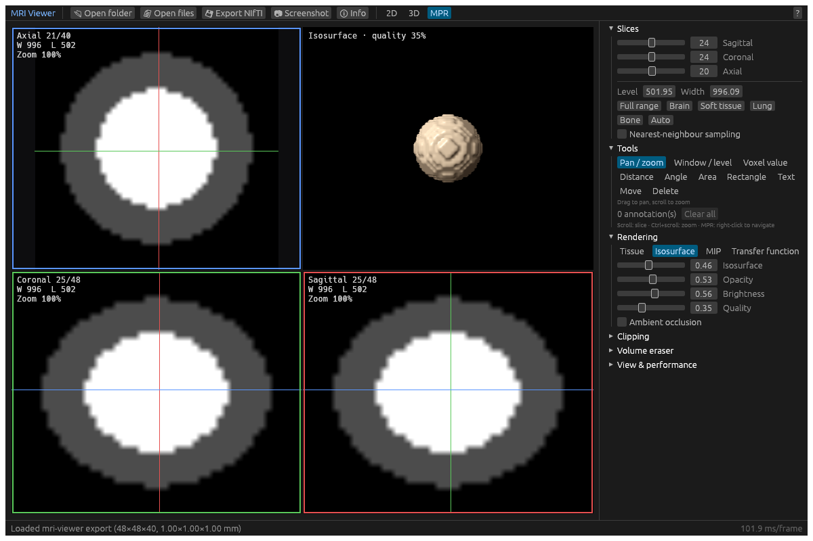
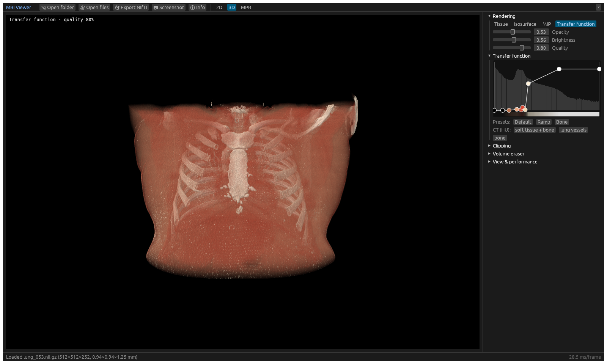
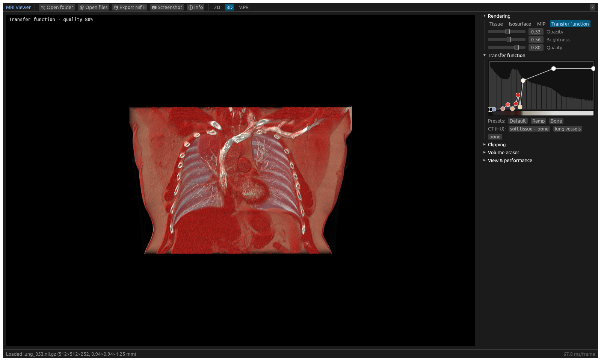
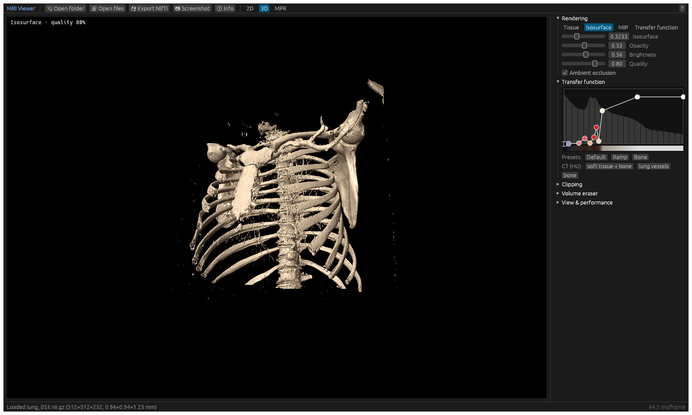
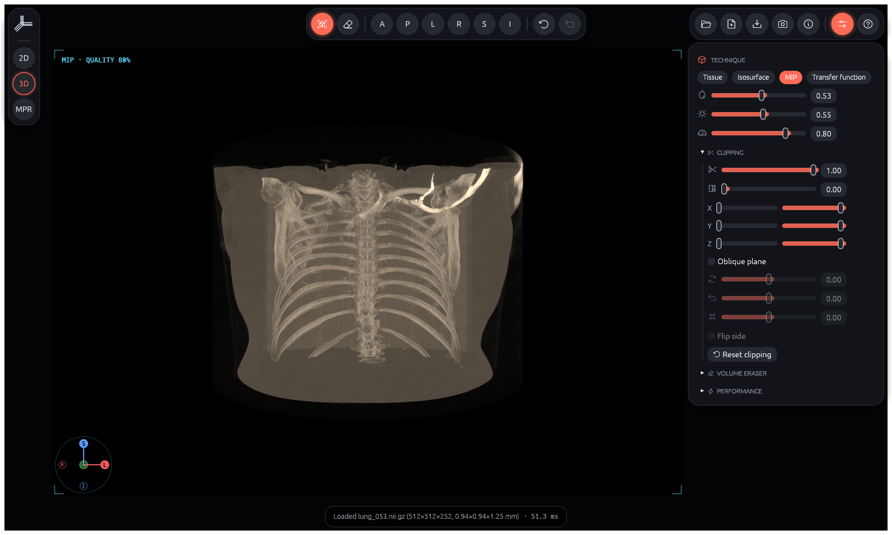
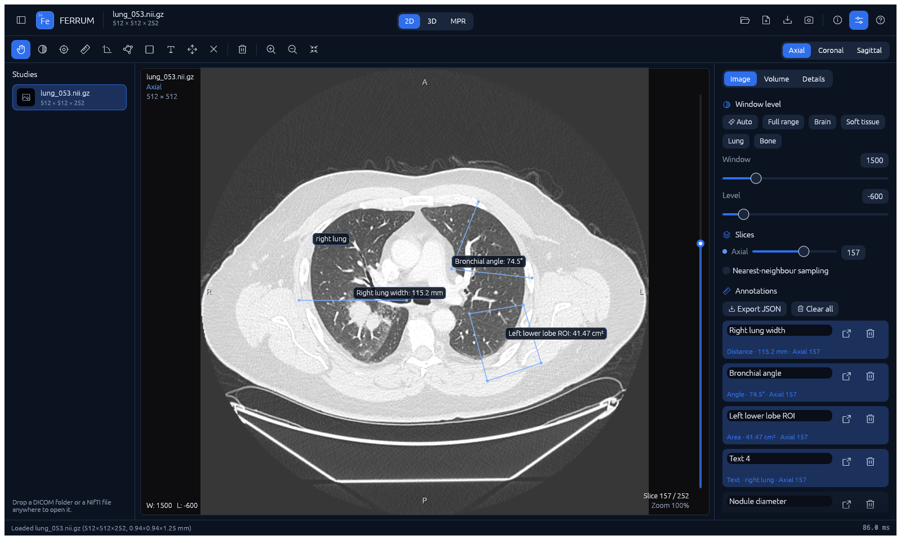
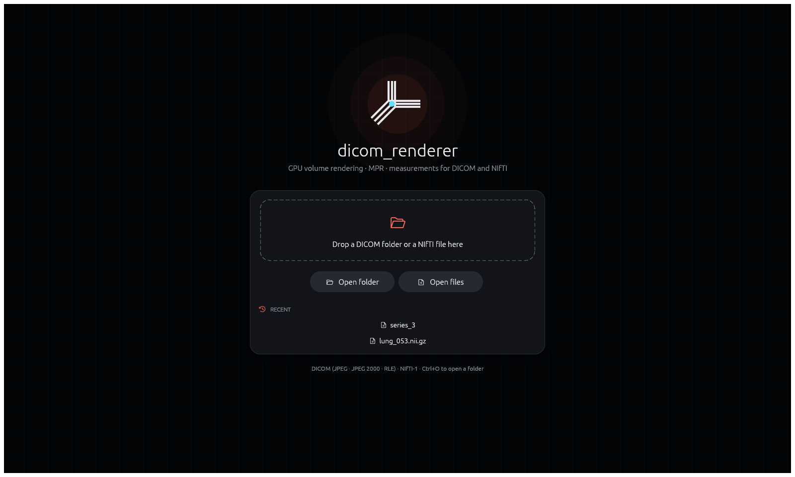
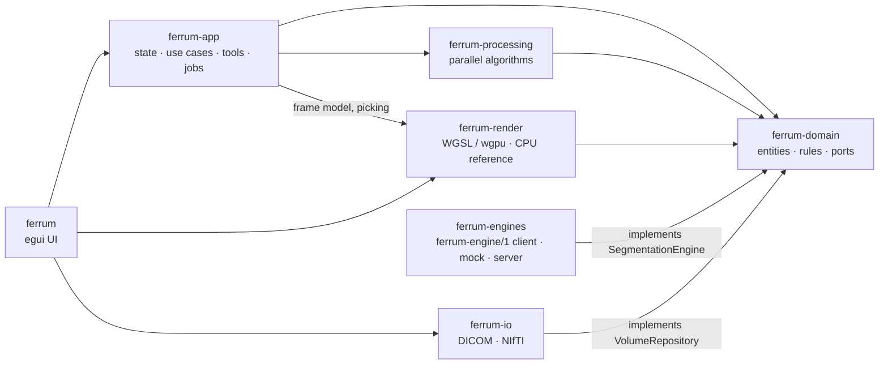

# FERRUM

**FERRUM. An open, high-performance visualisation core for medical imaging — for people, applications and AI agents.**

[](https://github.com/Kauter1989/ferrum/actions/workflows/ci.yml)
[](https://github.com/Kauter1989/ferrum/releases)


[](LICENSE)

*Ferrum* is Latin for iron, the metal whose oxide gives Rust its name.

FERRUM is a **reusable visualisation core** for volumetric medical images
(CT, MRI and other modalities, in DICOM or NIfTI), written from scratch in
Rust. It does one thing very well: it shows and quantifies volumes, with
2D slices, multiplanar reconstruction (MPR), interactive GPU volume
rendering, measurements and segments. Everything else plugs in through
open interfaces. FERRUM is built to be one component among many in an
ecosystem of tools for medical imaging and patient data, for commercial
and research use alike.

- **For people:** a fast desktop viewer.
- **For applications:** a Rust core with extension points. Data sources,
  segmentation engines and exporters are ports with swappable
  implementations.
- **For AI:** segmentation engines in any language connect through an
  open protocol, [`ferrum-engine/1`](docs/engine-protocol.md). A planned
  [agent skill](docs/agent-skill.md) lets AI agents in medical harnesses
  view, measure and segment images, while clinicians stay in control.

The rendering rebuilds proven, peer-reviewed techniques from scientific
visualization on a modern GPU stack (GPU ray casting, empty-space
skipping, isosurface refinement, local ambient occlusion; see
[Rendering](#rendering)), in one single-pass pipeline.

### At a glance

| Stack | |
|---|---|
| Language | Rust (stable, edition 2021), WGSL shaders |
| GPU | [wgpu](https://wgpu.rs) 30: Vulkan, Metal, DirectX 12, OpenGL |
| UI | [egui / eframe](https://github.com/emilk/egui) 0.36, Phosphor icons |
| Medical I/O | [dicom-rs](https://github.com/Enet4/dicom-rs) 0.10 (JPEG, JPEG 2000, RLE), own NIfTI-1 reader/writer |
| Parallelism, maths | rayon, glam |
| Testing | cargo test, proptest, naga (shader validation), egui_kittest (UI), criterion (benchmarks) |
| Architecture | clean architecture: 7 crates, domain ← data, presentation → application; ports for data sources and segmentation engines |
| Interfaces | desktop UI; Rust crates; `ferrum-engine/1` HTTP protocol for AI engines; agent skill with CLI + MCP (planned) |
| Platforms | Linux x86_64, macOS Apple Silicon, Windows x86_64 ([prebuilt releases](https://github.com/Kauter1989/ferrum/releases)) |

| Metrics | |
|---|---|
| Code size | ≈ 12 000 lines of Rust in `src/` (including in-module unit tests), ≈ 1 900 lines of integration tests and benchmarks, ≈ 500 lines of WGSL |
| Tests | 253: unit, property-based, data layer, shader validation, GPU-vs-CPU parity, engine-protocol conformance, application (incl. AI with a mock engine) and UI |
| Test coverage | 91.0 % of lines, 90.0 % of functions (`cargo-llvm-cov`); CI fails below 87 % |
| Complexity budget | per function: cognitive complexity ≤ 25, ≤ 120 lines, nesting ≤ 6 (enforced by clippy) |
| Lints | rustfmt and clippy with warnings as errors; no `unsafe`, no `unwrap` outside tests |
| Load speed | 512×512×252 CT DICOM series decoded in 0.34 s on 4 CPU cores |
| Rendering | isosurface ≈ 20 fps at 1200×672 even on a software GPU; see [Performance](#performance) |



| | |
|---|---|
|  |  |
| Transfer-function DVR, *CT soft tissue + bone* preset | *CT lung vessels* preset, anterior chest wall removed with the clip box |
|  |  |
| Isosurface at 300 HU with ambient occlusion; scanner table clipped | Maximum intensity projection |

| | |
|---|---|
|  |  |
| Named measurements and the annotation list | Start screen with drag-and-drop and recent studies |

<sub>Screenshots show the real application rendering a public chest CT — see [Sample data](#sample-data).</sub>

---

## Vision

FERRUM is a core, not a monolith. The principles, in short (full text:
[docs/vision.md](docs/vision.md)):

1. **A core with extension points.** FERRUM owns visualisation and
   measurement. Data sources, segmentation engines and exporters plug in
   through ports, and every use case lives in one UI-independent
   application layer.
2. **Open protocols instead of hard-wired integrations.** AI engines run
   out of process and speak [`ferrum-engine/1`](docs/engine-protocol.md).
   - Thin bridges connect nnInteractive, MONAI Label and
     TotalSegmentator.
   - A commercial engine plugs in through the same protocol.
   - A conformance suite lets any engine check itself.
   - There is no inference inside Rust.
3. **AI assists and stays optional.** The AI tools are visible but
   disabled until an engine is connected. Interactive AI segmentation
   starts as a documented nnInteractive demo. Engine licences are shown,
   with a *Research use only* badge where they apply.
4. **Built for people and for agents.** As an
   [agent skill](docs/agent-skill.md), FERRUM gives AI agents typed tools
   for viewing, measuring and segmenting. Agents propose and clinicians
   confirm, and every value comes from the voxels, not from pixels.
5. **Trust by design.**
   - No patient identifiers leave FERRUM by default.
   - Volumes are placed correctly in patient space.
   - The CPU reference renderer reproduces every GPU image.
   - Data goes in and out in standard formats.
   - Quality is enforced in CI.
6. **Fast everywhere.** Vulkan, Metal, DirectX 12 and OpenGL on Linux,
   macOS and Windows.

| Area | Status |
|---|---|
| Viewer, annotations with JSON export, segments with 2D/3D overlay and NIfTI label maps | ✅ |
| Engine port, `ferrum-engine/1` client, mock engine, reference server, conformance suite | ✅ |
| AI segmentation panel (point, box, scribble, lasso; include/exclude; accept, discard, undo) | 🚧 in review |
| nnInteractive bridge (FastAPI, Docker) and [demo guide](docs/ai-demo.md) | 🚧 in review |
| Automatic segmentation; TotalSegmentator bridge | 🚧 in review |
| MONAI Label bridge | 📋 [Stage 14](dev_plan.md) |
| Agent skill: provenance, workspaces, `ferrum-cli` (CLI + MCP), review queue, DICOM SEG/SR | 📋 [Stage 15](dev_plan.md) |

> FERRUM is research and engineering software, not a certified medical
> device. Measurements, segmentations and AI results are proposals for
> review by qualified people.

## Contents

- [Vision](#vision)
- [Features](#features)
- [Quick start](#quick-start)
- [Using the viewer](#using-the-viewer)
- [Supported data and limits](#supported-data-and-limits)
- [Rendering](#rendering)
- [Performance](#performance)
- [Architecture](#architecture)
- [Development](#development)
- [Testing](#testing)
- [Project layout](#project-layout)
- [Sample data](#sample-data)
- [References](#references)
- [License](#license)

## Features

**Data**
- DICOM Part 10: explicit/implicit VR, little/big endian, JPEG, JPEG 2000,
  RLE and deflate transfer syntaxes, multi-frame files, rescale
  slope/intercept, signed pixels, MONOCHROME1, colour images.
- Scans folders recursively and groups slices into series. Slices are
  sorted by their position along the plane normal, with fallbacks to
  Instance Number and Slice Location.
- NIfTI-1 (`.nii`, `.nii.gz`) reading and export; `sform`/`qform` orientation is
  honoured and every volume is brought into the DICOM patient frame (LPS),
  so NIfTI and DICOM data display identically.
- Parallel loading with progress reporting and cancellation. You pick the
  series when a folder contains more than one.

**2D and MPR**
- Axial, coronal and sagittal slices rendered on the GPU straight from the
  3D texture.
- Window/level by mouse drag, numeric input, presets (brain, soft tissue,
  lung, bone) or automatic percentiles.
- Pan, zoom around the cursor, and nearest or linear sampling.
- MPR layout: three slice views plus the 3D view. Crosshairs are
  colour-coded by plane; right-click jumps all views to a point.
- Voxel probe that reads the physical value (e.g. Hounsfield units).

**Measurements and annotations** — distance, angle, free-form area,
rectangle and text notes, all in millimetres (anisotropic voxels are
handled). Every annotation has an editable name. In the 2D view, the
*Image* tab lists all annotations of the study with their value, plane
and slice: a click shows that slice, and each annotation can be renamed
or deleted. **Export JSON** saves the named annotations together with the
source file or folder and the DICOM study identification (study and
series UIDs, date and time, descriptions, modality), with points in
in-plane millimetres and voxel coordinates.

**Segments** — a label map on the volume grid with up to 255 segments,
each with a name, colour, visibility, opacity and volume in millilitres.
Segments are drawn in 2D (fill plus outline) and in 3D (shaded, depth
correct, hidden by the eraser), and are imported from or exported to NIfTI
label maps placed in patient space, so files from other tools (e.g.
TotalSegmentator or ITK-SNAP) line up with the image. Segment edits can be
undone. This is the base for AI segmentation engines
([ADR 0007](docs/decisions/0007-extensibility-and-engine-protocol.md)).

**3D rendering**
- Four techniques:
  - *Tissue*: a translucent band followed by a shaded surface.
  - *Isosurface*.
  - *Maximum intensity projection*.
  - *Transfer-function* direct volume rendering.
- Opacity, brightness and quality (sampling rate) controls.
- Optional ambient occlusion.
- Trackball rotation, pan, zoom, reset, and one-click anatomical views
  (anterior, posterior, left, right, superior, inferior).

**Transfer function editor** — control points drawn over a log-scaled
intensity histogram. Drag points, double-click to add, right-click to
remove, and pick a colour per point. Generic presets plus CT presets
defined in Hounsfield units (*soft tissue + bone*, *lung vessels*, *bone*)
that adapt to the data range of the loaded scan.

**Clipping**
- View-aligned cut ("virtual knife").
- Axis-aligned clip box.
- Oblique plane with adjustable azimuth, elevation and offset.
- Optional overlay of the raw slice on the cut surface.

**Volume eraser** — a cylindrical brush with adjustable radius and depth,
undo and full restore.

**Interface** — a calm, workstation-style layout in navy tones with a
single blue accent:
- a header with the open study, the 2D / 3D / MPR switch and file actions;
- a toolbar with the tools of the current mode;
- a *Studies* sidebar with the current study and recently opened ones;
- a settings panel (**Tab**) with *Image*, *Volume* and *Details* tabs;
- a status bar.

Views show quiet corner read-outs (plane, matrix, W/L, slice, zoom),
patient-orientation edge labels (R/L, A/P, S/I), a slice scrubber, and an
L/P/S orientation gizmo in 3D.

**AI segmentation** — the collapsible *AI segmentation* section, in the
*Image* and *Volume* tabs, is always visible.
- **Without an engine** its tools are disabled, and a hint explains how
  to connect one.
- **Connecting:** enter the engine URL (default `http://127.0.0.1:8765`
  or `FERRUM_ENGINE_URL`) and press **Connect**. The section then shows
  the engine's name and device. A *Research use only* badge and the
  licence notice appear when the engine reports them.
- **Prompts** are drawn in the 2D views:
  - *point*: click;
  - *box*: drag;
  - *scribble*: paint;
  - *lasso*: outline.

  Each prompt either **includes** the area or **excludes** it.
- **Results:** the volume is uploaded once in the background. Each
  prompt refines the current object, which is shown live as the target
  segment.
- **Finishing an object:** **Accept** keeps the segment and starts the
  next object, **Discard** removes it, and **Undo prompt** steps back
  when the engine supports it.
- **Automatic engines** (such as TotalSegmentator) add an *Automatic*
  part to the section:
  - choose structures from the engine's list (with a filter), or segment
    all of them;
  - follow the job's progress, or cancel it;
  - every structure found becomes a named, coloured segment. Voxels that
    already belong to a segment are kept.

Engines speak [`ferrum-engine/1`](docs/engine-protocol.md). To try the
tools without a GPU or a model, run the mock engine (region growing):
`cargo run -p ferrum-engines --example mock_server -- 127.0.0.1:8765`.
For real AI segmentation, run nnInteractive on a GPU machine through
[`bridges/`](bridges) (`ferrum-bridge nninteractive`), and automatic
segmentation with TotalSegmentator (`ferrum-bridge totalsegmentator`) — see the demo guide
[docs/ai-demo.md](docs/ai-demo.md) (Docker, SSH tunnel, walkthrough;
weights CC BY-NC-SA 4.0, research use only).

**Output** — PNG screenshots, NIfTI volume and label-map export,
annotation JSON, and the series' DICOM attributes in the *Details* tab.

## Quick start

**Prebuilt binary (no Rust needed).** Download the archive for your system
(Linux x86_64, macOS Apple Silicon, Windows x86_64) from
[Releases](https://github.com/Kauter1989/ferrum/releases), unpack
it and run `ferrum`. You can also pass paths on the command line:

```bash
./ferrum /path/to/dicom-folder
```

**Install with Cargo** (puts `ferrum` on your `PATH`):

```bash
cargo install --git https://github.com/Kauter1989/ferrum ferrum
ferrum /path/to/dicom-folder
```

**From source:**

```bash
git clone https://github.com/Kauter1989/ferrum
cd ferrum
cargo run --release -- /path/to/dicom-folder
```

Requirements:
- A GPU with Vulkan, Metal, DirectX 12 or OpenGL support.
- On Linux: `libxkbcommon-x11` and a Vulkan or GL driver. These are present
  on most desktop installations.
- To build from source: a stable Rust toolchain. `rust-toolchain.toml`
  pins it, and `rustup` installs it automatically.

A GPU desktop application gains nothing from Docker. The container would
need the host's display server and GPU passed through, and on macOS and
Windows Docker cannot reach the GPU at all. Use the prebuilt binary
instead.

You can pass folders, DICOM files or NIfTI files on the command line, drop
them onto the window, or use **Open folder** / **Open files**.

## Using the viewer

| Action | 2D / MPR views | 3D view |
|---|---|---|
| Left drag | active tool (pan, window/level, measure…) | rotate (or erase in eraser mode) |
| Right / middle drag | — | pan |
| Mouse wheel | next/previous slice | zoom |
| Ctrl + wheel | zoom around cursor | — |
| Double click | reset pan/zoom (pan tool) | reset camera |
| Right click | MPR: move crosshair to this point | — |

Keyboard: **F2 / F3 / F4** switch between 2D, 3D and MPR. **Tab** shows or
hides the settings panel.
**↑ ↓ / PgUp PgDn** change the slice. **Ctrl+O** opens a folder.
**Ctrl+Z** undoes the last erase.

## Rendering

All rendering runs on the GPU through [wgpu](https://wgpu.rs), which means
Vulkan, Metal, DX12 or GL depending on the platform. The volume is uploaded
once as a 16-bit 3D texture (`R16Unorm`, with an `R16Float` fallback).
Volumes larger than the device limit are downsampled automatically.

The image-formation model follows established volume-rendering research:

| Technique | Used for | Reference |
|---|---|---|
| Ray casting with front-to-back emission–absorption compositing | all 3D techniques | Levoy 1988; Max 1995 |
| Gradient estimation by central differences and Phong shading | surfaces, lit transfer functions | Levoy 1988 |
| Single-pass GPU ray casting, early ray termination, empty-space skipping | performance | Krüger & Westermann 2003 |
| Isosurface ray casting with bisection refinement of the hit point | *Isosurface* and *Tissue* | Hadwiger et al. 2005 |
| Opacity correction for the sampling rate; stochastic jittering of ray starts | *Transfer function*, quality control | Engel et al. 2006 |
| Maximum intensity projection | *MIP* | Wallis et al. 1989 |
| Local ambient occlusion (vicinity shading) | depth perception on surfaces | Stewart 2003; Hernell et al. 2010 |

The *Tissue* technique combines two of these: a translucent band
composited in front of a shaded isosurface.

The engineering keeps these methods interactive on large data:

1. **Single pass.** One full-screen triangle per frame. Each pixel builds
   its ray from the inverse view-projection matrix and intersects it
   analytically with the volume box and up to eight clipping half-spaces.
   There are no back-face or front-face render targets.
2. **Specialised pipelines.** The render technique is a pipeline-overridable
   constant, so each mode compiles to a branch-free shader.
3. **Empty-space skipping.** A min/max brick grid (8³ voxels per brick) is
   classified against the current mode and transfer function, and the ray
   jumps over empty bricks. Samples stay snapped to the same grid, so the
   image is identical with and without skipping.
4. **Dynamic resolution.** The 3D view renders at reduced resolution while
   you rotate it and at full resolution when you stop.
5. **Precomputed ambient occlusion.** Obscurance is computed once per
   threshold with separable box filters, instead of tracing occlusion rays
   per pixel.
6. **Correct anisotropy.** Normals and step sizes account for non-cubic
   voxels.
7. **Jittered ray starts.** Each pixel's starting offset is jittered to
   remove wood-grain artefacts.

The eraser mask is uploaded incrementally: only the region a stroke changed
is sent to the GPU.

A **CPU reference ray caster** implements exactly the same image-formation
model. It is the test oracle for GPU output, the picker for interactive
tools, and a software fallback.

## Supported data and limits

**Modalities.** The pipeline works on any scalar 3D grid, so it is not tied
to one modality:

| Modality | Notes |
|---|---|
| CT (incl. CT angiography) | Values in Hounsfield units; CT window and transfer-function presets |
| MRI (T1, T2, FLAIR, PD, DWI/ADC, MRA…) | Any sequence; windowing is automatic because MR intensities are arbitrary |
| PET, SPECT (NM) | MIP and transfer-function rendering suit uptake maps |
| Cone-beam CT (dental, ENT, intra-operative) | Same as CT |
| Micro-CT and other preclinical scanners | Usually via NIfTI |
| 3D rotational angiography (XA 3D) | When exported as a volume |
| 3D ultrasound | When exported as volumetric DICOM or NIfTI |

Colour images are converted to luminance, and 4D NIfTI (fMRI, DTI, dynamic
series) shows its first volume. Single 2D projection images (CR, DX, MG)
open as one slice; 3D rendering is meaningless for them.

**Grid size.**
- *Loading* has no fixed limit and is bound by RAM. Decoding briefly uses
  about 6 bytes per voxel: 4 for the `f32` decode buffer and 2 for the
  16-bit stored volume. The eraser adds 1 byte per voxel. For example, a
  512×512×2000 CT (0.5 G voxels) needs about 3 GB at peak.
- *Visualisation* on the GPU needs every dimension to fit the device's
  3D-texture limit (`max_texture_dimension_3d`). The limit is 2048 on most
  desktop GPUs and on Metal/D3D12, and larger on some Vulkan drivers
  (4096 on lavapipe). GPU memory costs 2 bytes per voxel, plus 1 byte for
  the eraser mask. Larger volumes are box-downsampled automatically for 3D
  and 2D display, and measurements stay in physical millimetres. In
  practice, 1024³ (2 GB of VRAM) renders interactively on a mid-range
  discrete GPU.

## Performance

**Test machine.** All numbers below come from one machine:

| Component | Details |
|---|---|
| CPU | Intel Xeon @ 2.80 GHz, 4 cores (cloud VM) |
| RAM | 16 GB |
| GPU | none; rendering ran on **llvmpipe** (Mesa 25.2, LLVM 20), a software Vulkan rasteriser running on the same 4 CPU cores |
| Build | `--release`, Rust 1.98 |

Because the GPU is emulated on the CPU, the frame rates are a lower bound.
A discrete GPU renders one to two orders of magnitude faster. Load and
processing times do not use the GPU and are representative.

**Chest CT, 512×512×252 DICOM series (`lung_053`), 3D view at 1200×672:**

| Stage | Time |
|---|---|
| Scan + decode 252 DICOM files | 339 ms |
| Histogram + brick grid | 55 ms |
| Upload to the GPU (`R16Unorm`) | 116 ms |
| Change a 2D slice | 4 ms |
| Open the same scan as `.nii.gz` | 1.2 s |

| Technique | Empty-space skipping off | on |
|---|---|---|
| Tissue | 119 ms (8.4 fps) | 98 ms (10.2 fps) |
| Isosurface | 139 ms (7.2 fps) | 51 ms (19.8 fps) |
| MIP | 117 ms (8.5 fps) | 160 ms (6.2 fps) |
| Transfer function | 172 ms (5.8 fps) | 158 ms (6.3 fps) |

Frame times include reading the image back to the CPU. MIP gains nothing
from skipping, because every non-empty brick can hold the maximum. On a
CPU rasteriser, the extra brick lookups make MIP slower.

Other measurements on the same machine (`cargo bench --workspace` and
`make snapshot`):

| Operation | Result |
|---|---|
| Load a 19-slice 320×320 DICOM series | ≈ 15 ms |
| Load a 256×256×128 DICOM series | ≈ 50 ms |
| Histogram of a 256³ volume | 1.5 Gvoxel/s |
| Min/max brick grid, 256³ | 2 Gvoxel/s |
| Ambient occlusion, 256³ | ≈ 48 ms |

Reproduce the end-to-end numbers with
`make snapshot ARGS="<series> <out_dir> 1200 672"`. The tool prints load,
upload and per-technique frame timings.

## Architecture

Clean architecture with one crate per layer. Dependencies point inward:
the data layer implements ports defined by the domain, and the application
layer compiles without any GPU or UI library.



| Crate | Responsibility |
|---|---|
| `ferrum-domain` | Volume, window/level, transfer function, render settings, clipping, camera, slice geometry, annotations, eraser mask, patient geometry, label maps and segments. Also the `VolumeRepository` port. No I/O. |
| `ferrum-processing` | Histogram, brick grid, ambient occlusion, filters and resampling, parallelised with rayon |
| `ferrum-io` | DICOM and NIfTI repositories (dicom-rs): scanning, series grouping, slice ordering, parallel decoding; NIfTI label maps; annotation JSON |
| `ferrum-render` | Frame model shared by GPU and CPU, WGSL shaders, the wgpu renderer (feature `gpu`) and the CPU ray caster |
| `ferrum-engines` | Segmentation engines: the `ferrum-engine/1` HTTP client, a mock engine without a model, a reference server and a conformance suite |
| `ferrum-app` | The `Viewer` facade: loading jobs, slice and 3D state, 2D tool state machines, eraser with undo, segments, and GPU synchronisation through the `GpuSink` port |
| `ferrum` | eframe/egui application: panels, widgets, paint callbacks, dialogs |

Extension points:

| Port | Implementations |
|---|---|
| `VolumeRepository` (data sources) | DICOM, NIfTI |
| `SegmentationEngine` / `InteractiveSession` | `HttpEngine` (any `ferrum-engine/1` engine), `MockEngine` |
| `Exporter` | planned; NIfTI, label maps and annotation JSON exist |

Two crates are planned for the agent skill: `ferrum-agent` (commands,
schemas, workspaces) and `ferrum-cli` (CLI and MCP server). Both sit on
`ferrum-app` like the desktop UI.

Read more: [vision](docs/vision.md) ·
[engine protocol](docs/engine-protocol.md) ·
[agent skill](docs/agent-skill.md).
Details: [docs/architecture.md](docs/architecture.md) ·
decisions: [docs/decisions/](docs/decisions/).

## Development

```bash
make test        # all tests; GPU tests are skipped without an adapter
make test-gpu    # same, but a missing GPU adapter fails the run (CI mode)
make lint        # rustfmt --check + clippy -D warnings (incl. complexity budget)
make coverage    # test coverage report (cargo-llvm-cov)
make install     # install the ferrum binary into ~/.cargo/bin
make bench       # criterion benchmarks
make snapshot ARGS="<input> <out_dir>"   # headless PNG renders of every mode
make showcase ARGS="<input> <out_dir>"   # regenerate the README screenshots
```

Conventions:
- Every public item has a doc comment.
- No `unwrap`/`expect` outside tests.
- Changes to `volume.wgsl` must be mirrored in the CPU ray caster.
- Image data is never committed.

See [CLAUDE.md](CLAUDE.md) for the full rules.

To run GPU tests without a graphics card, install Mesa's software Vulkan
driver (`mesa-vulkan-drivers` on Debian/Ubuntu).

## Testing

About 230 tests run headlessly with `cargo test --workspace`:

| Level | What is checked |
|---|---|
| Unit | domain maths, windowing, transfer functions, clipping, camera, measurements, processing algorithms |
| Property-based | invariants over random inputs, e.g. that empty-space skipping can never hide visible material |
| Data layer | DICOM files generated at test time: transfer syntaxes, rescale, signed data, MONOCHROME1, multi-frame, several series, corrupt files; NIfTI round-trip, patient geometry and label maps |
| Shaders | WGSL validated with naga, and uniform layouts matched to the Rust structs |
| GPU parity | every render mode and feature (including the segment overlay), GPU image compared to the CPU reference |
| Engine protocol | conformance suite against the reference server, or any engine with `FERRUM_ENGINE_URL` |
| Application | use cases with an in-memory repository and a recording GPU sink |
| UI | the real app driven with egui_kittest, plus full-window renders of 2D, 3D and MPR |

To also test on a real DICOM series:
`FERRUM_SAMPLE_DICOM=/path/to/series cargo test -p ferrum-io`.
Line coverage is about 91 %, and CI fails if it drops below 87 %. Clippy
also enforces a complexity budget for every function. More in
[docs/testing.md](docs/testing.md) and [docs/quality.md](docs/quality.md).

## Project layout

```
.
├── crates/
│   ├── ferrum-domain/       # domain model and ports
│   ├── ferrum-processing/   # parallel volume algorithms
│   ├── ferrum-io/           # DICOM / NIfTI repositories
│   ├── ferrum-render/       # shaders, GPU renderer, CPU reference
│   ├── ferrum-engines/      # segmentation engines: protocol client, mock, reference server
│   ├── ferrum-app/          # application layer
│   └── ferrum/              # desktop application (binary: ferrum)
├── bridges/                # engines over ferrum-engine/1: nnInteractive, TotalSegmentator (Python, Docker)
├── docs/                    # vision, architecture, engine protocol, agent skill, AI demo, testing, ADRs
├── .github/workflows/       # CI (fmt, clippy, tests on lavapipe) and release archives
└── Makefile
```

## Sample data

The screenshots are rendered from case `lung_053` of the **Medical
Segmentation Decathlon** lung task (*Task06_Lung*), a public, de-identified
chest CT collection originating from The Cancer Imaging Archive, licensed
under [CC BY-SA 4.0](https://creativecommons.org/licenses/by-sa/4.0/):

> M. Antonelli, A. Reinke, S. Bakas et al. *The Medical Segmentation
> Decathlon.* Nature Communications 13, 4128 (2022).

The screenshots in `docs/images/` are derivative works of that data and are
distributed under the same CC BY-SA 4.0 licence. No image data is stored in
this repository. The start screen is rendered by the UI test suite. To
reproduce the others, download `Task06_Lung.tar` from the
Decathlon, extract `imagesTr/lung_053.nii.gz`, and run:

```bash
make showcase ARGS="path/to/lung_053.nii.gz docs/images"
```

## References

- M. Levoy. *Display of surfaces from volume data.* IEEE Computer
  Graphics and Applications 8(3), 29–37, 1988.
- N. Max. *Optical models for direct volume rendering.* IEEE Transactions
  on Visualization and Computer Graphics 1(2), 99–108, 1995.
- J. Krüger, R. Westermann. *Acceleration techniques for GPU-based volume
  rendering.* IEEE Visualization 2003, 287–292.
- M. Hadwiger, C. Sigg, H. Scharsach, K. Bühler, M. Gross. *Real-time
  ray-casting and advanced shading of discrete isosurfaces.* Computer
  Graphics Forum 24(3), 303–312, 2005.
- K. Engel, M. Hadwiger, J. Kniss, C. Rezk-Salama, D. Weiskopf.
  *Real-Time Volume Graphics.* A K Peters, 2006.
- J. W. Wallis, T. R. Miller, C. A. Lerner, E. C. Kleerup.
  *Three-dimensional display in nuclear medicine.* IEEE Transactions on
  Medical Imaging 8(4), 297–303, 1989.
- A. J. Stewart. *Vicinity shading for enhanced perception of volumetric
  data.* IEEE Visualization 2003, 355–362.
- F. Hernell, P. Ljung, A. Ynnerman. *Local ambient occlusion in direct
  volume rendering.* IEEE Transactions on Visualization and Computer
  Graphics 16(4), 548–559, 2010.

## License

Source code: MIT — see [LICENSE](LICENSE).
Screenshots in `docs/images/`: CC BY-SA 4.0 (see [Sample data](#sample-data)).
