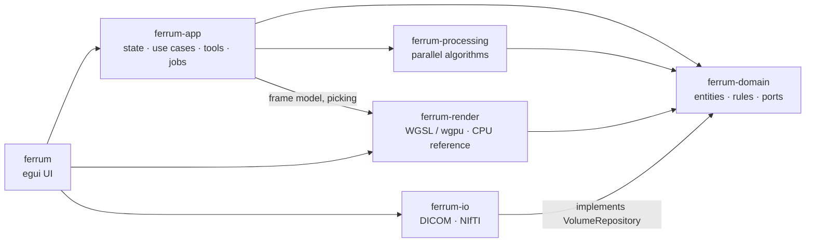

# FERRUM

**FERRUM. High-performance medical imaging.**

*Ferrum* is Latin for iron, the metal whose oxide gives Rust its name.
FERRUM is a fast desktop viewer for volumetric medical images (CT and MRI
in DICOM or NIfTI), written in Rust. It shows 2D slices, multiplanar
reconstruction (MPR) and GPU volume rendering, with interactive transfer
functions, clipping, measurements and a volume eraser.


| | |
|---|---|
|  |  |
| Transfer-function DVR, *CT soft tissue + bone* preset | *CT lung vessels* preset, anterior chest wall removed with the clip box |
|  |  |
| Isosurface at 300 HU with ambient occlusion; scanner table clipped | Maximum intensity projection |

| | |
|---|---|
|  |  |
| Measurements in millimetres on an axial slice | Start screen with drag-and-drop and recent studies |

<sub>Screenshots show the real application rendering a public chest CT — see [Sample data](#sample-data).</sub>

---

## Contents

- [Features](#features)
- [Quick start](#quick-start)
- [Using the viewer](#using-the-viewer)
- [Supported data and limits](#supported-data-and-limits)
- [Rendering](#rendering)
- [Performance](#performance)
- [Architecture](#architecture)
- [Development](#development)
- [Testing](#testing)
- [Project layout](#project-layout)
- [Sample data](#sample-data)
- [License](#license)

## Features

**Data**
- DICOM Part 10: explicit/implicit VR, little/big endian, JPEG, JPEG 2000,
  RLE and deflate transfer syntaxes, multi-frame files, rescale
  slope/intercept, signed pixels, MONOCHROME1, colour images.
- Scans folders recursively and groups slices into series. Slices are
  sorted by their position along the plane normal, with fallbacks to
  Instance Number and Slice Location.
- NIfTI-1 (`.nii`, `.nii.gz`) reading and export; `sform`/`qform` orientation is
  honoured and every volume is brought into the DICOM patient frame (LPS),
  so NIfTI and DICOM data display identically.
- Parallel loading with progress reporting and cancellation. You pick the
  series when a folder contains more than one.

**2D and MPR**
- Axial, coronal and sagittal slices rendered on the GPU straight from the
  3D texture.
- Window/level by mouse drag, numeric input, presets (brain, soft tissue,
  lung, bone) or automatic percentiles.
- Pan, zoom around the cursor, and nearest or linear sampling.
- MPR layout: three slice views plus the 3D view. Crosshairs are
  colour-coded by plane; right-click jumps all views to a point.
- Voxel probe that reads the physical value (e.g. Hounsfield units).

**Measurements** — distance, angle, free-form area, rectangle and text
notes, all in millimetres (anisotropic voxels are handled). You can move,
delete and clear them.

**3D rendering**
- Four techniques:
  - *Tissue*: a translucent band followed by a shaded surface.
  - *Isosurface*.
  - *Maximum intensity projection*.
  - *Transfer-function* direct volume rendering.
- Opacity, brightness and quality (sampling rate) controls.
- Optional ambient occlusion.
- Trackball rotation, pan, zoom, reset, and one-click anatomical views
  (anterior, posterior, left, right, superior, inferior).

**Transfer function editor** — control points drawn over a log-scaled
intensity histogram. Drag points, double-click to add, right-click to
remove, and pick a colour per point. Generic presets plus CT presets
defined in Hounsfield units (*soft tissue + bone*, *lung vessels*, *bone*)
that adapt to the data range of the loaded scan.

**Clipping**
- View-aligned cut ("virtual knife").
- Axis-aligned clip box.
- Oblique plane with adjustable azimuth, elevation and offset.
- Optional overlay of the raw slice on the cut surface.

**Volume eraser** — a cylindrical brush with adjustable radius and depth,
undo and full restore.

**Processing** — Gaussian smoothing and Sobel edge filters.

**Interface** — a calm, workstation-style layout in navy tones with a
single blue accent:
- a header with the open study, the 2D / 3D / MPR switch and file actions;
- a toolbar with the tools of the current mode;
- a *Studies* sidebar with the current study and recently opened ones;
- a settings panel (**Tab**) with *Image*, *Volume* and *Details* tabs;
- a status bar.

Views show quiet corner read-outs (plane, matrix, W/L, slice, zoom),
patient-orientation edge labels (R/L, A/P, S/I), a slice scrubber, and an
L/P/S orientation gizmo in 3D.

**Output** — PNG screenshots, NIfTI export, and the series' DICOM
attributes in the *Details* tab.

## Quick start

**Prebuilt binary (no Rust needed).** Download the archive for your system
(Linux x86_64, macOS Apple Silicon, Windows x86_64) from
[Releases](https://github.com/Kauter1989/dicom_renderer/releases), unpack
it and run `ferrum`. You can also pass paths on the command line:

```bash
./ferrum /path/to/dicom-folder
```

**Install with Cargo** (puts `ferrum` on your `PATH`):

```bash
cargo install --git https://github.com/Kauter1989/dicom_renderer ferrum
ferrum /path/to/dicom-folder
```

**From source:**

```bash
git clone https://github.com/Kauter1989/dicom_renderer
cd dicom_renderer
cargo run --release -- /path/to/dicom-folder
```

Requirements:
- A GPU with Vulkan, Metal, DirectX 12 or OpenGL support.
- On Linux: `libxkbcommon-x11` and a Vulkan or GL driver. These are present
  on most desktop installations.
- To build from source: a stable Rust toolchain. `rust-toolchain.toml`
  pins it, and `rustup` installs it automatically.

A GPU desktop application gains nothing from Docker. The container would
need the host's display server and GPU passed through, and on macOS and
Windows Docker cannot reach the GPU at all. Use the prebuilt binary
instead.

You can pass folders, DICOM files or NIfTI files on the command line, drop
them onto the window, or use **Open folder** / **Open files**.

## Using the viewer

| Action | 2D / MPR views | 3D view |
|---|---|---|
| Left drag | active tool (pan, window/level, measure…) | rotate (or erase in eraser mode) |
| Right / middle drag | — | pan |
| Mouse wheel | next/previous slice | zoom |
| Ctrl + wheel | zoom around cursor | — |
| Double click | reset pan/zoom (pan tool) | reset camera |
| Right click | MPR: move crosshair to this point | — |

Keyboard: **F2 / F3 / F4** switch between 2D, 3D and MPR. **Tab** shows or
hides the settings panel.
**↑ ↓ / PgUp PgDn** change the slice. **Ctrl+O** opens a folder.
**Ctrl+Z** undoes the last erase.

## Rendering

All rendering runs on the GPU through [wgpu](https://wgpu.rs), which means
Vulkan, Metal, DX12 or GL depending on the platform. The volume is uploaded
once as a 16-bit 3D texture (`R16Unorm`, with an `R16Float` fallback).
Volumes larger than the device limit are downsampled automatically.

The ray-casting algorithms are a WGSL port of the author's own WebGL shaders
from an earlier web viewer:
- tissue band plus isosurface compositing;
- bisection refinement of isosurface hits;
- gradient-based Phong shading;
- MIP;
- transfer-function integration.

The port reworks the pipeline for performance:

1. **Single pass.** One full-screen triangle per frame. Each pixel builds
   its ray from the inverse view-projection matrix and intersects it
   analytically with the volume box and up to eight clipping half-spaces.
   There are no back-face or front-face render targets.
2. **Specialised pipelines.** The render technique is a pipeline-overridable
   constant, so each mode compiles to a branch-free shader.
3. **Empty-space skipping.** A min/max brick grid (8³ voxels per brick) is
   classified against the current mode and transfer function, and the ray
   jumps over empty bricks. Samples stay snapped to the same grid, so the
   image is identical with and without skipping.
4. **Dynamic resolution.** The 3D view renders at reduced resolution while
   you rotate it and at full resolution when you stop.
5. **Precomputed ambient occlusion.** Volumetric obscurance is computed once
   per threshold with separable box filters, instead of tracing occlusion
   rays per pixel.
6. **Correct anisotropy.** Normals and step sizes account for non-cubic
   voxels.
7. **Jittered ray starts.** Each pixel's starting offset is jittered to
   remove wood-grain artefacts.

The eraser mask is uploaded incrementally: only the region a stroke changed
is sent to the GPU.

A **CPU reference ray caster** implements exactly the same image-formation
model. It is the test oracle for GPU output, the picker for interactive
tools, and a software fallback.

## Supported data and limits

**Modalities.** The pipeline works on any scalar 3D grid, so it is not tied
to one modality:

| Modality | Notes |
|---|---|
| CT (incl. CT angiography) | Values in Hounsfield units; CT window and transfer-function presets |
| MRI (T1, T2, FLAIR, PD, DWI/ADC, MRA…) | Any sequence; windowing is automatic because MR intensities are arbitrary |
| PET, SPECT (NM) | MIP and transfer-function rendering suit uptake maps |
| Cone-beam CT (dental, ENT, intra-operative) | Same as CT |
| Micro-CT and other preclinical scanners | Usually via NIfTI |
| 3D rotational angiography (XA 3D) | When exported as a volume |
| 3D ultrasound | When exported as volumetric DICOM or NIfTI |

Colour images are converted to luminance, and 4D NIfTI (fMRI, DTI, dynamic
series) shows its first volume. Single 2D projection images (CR, DX, MG)
open as one slice; 3D rendering is meaningless for them.

**Grid size.**
- *Loading* has no fixed limit and is bound by RAM. Decoding briefly uses
  about 6 bytes per voxel: 4 for the `f32` decode buffer and 2 for the
  16-bit stored volume. The eraser adds 1 byte per voxel. For example, a
  512×512×2000 CT (0.5 G voxels) needs about 3 GB at peak.
- *Visualisation* on the GPU needs every dimension to fit the device's
  3D-texture limit (`max_texture_dimension_3d`). The limit is 2048 on most
  desktop GPUs and on Metal/D3D12, and larger on some Vulkan drivers
  (4096 on lavapipe). GPU memory costs 2 bytes per voxel, plus 1 byte for
  the eraser mask. Larger volumes are box-downsampled automatically for 3D
  and 2D display, and measurements stay in physical millimetres. In
  practice, 1024³ (2 GB of VRAM) renders interactively on a mid-range
  discrete GPU.
- The earlier web viewer this project replaces capped 3D data at
  512×512×256.

## Performance

All numbers come from the same 4-core cloud VM, with no hardware GPU.
Rendering ran on **llvmpipe**, Mesa's software Vulkan rasteriser, so the
frame rates are a floor. A discrete GPU is one to two orders of magnitude
faster at rendering.

**Chest CT, 512×512×252 DICOM series (`lung_053`), 3D view at 1200×672:**

| Stage | Time |
|---|---|
| Scan + decode 252 DICOM files | 339 ms |
| Histogram + brick grid | 55 ms |
| Upload to the GPU (`R16Unorm`) | 116 ms |
| Change a 2D slice | 4 ms |

| Technique | Empty-space skipping off | on |
|---|---|---|
| Tissue | 119 ms (8.4 fps) | 98 ms (10.2 fps) |
| Isosurface | 139 ms (7.2 fps) | 51 ms (19.8 fps) |
| MIP | 117 ms (8.5 fps) | 160 ms (6.2 fps) |
| Transfer function | 172 ms (5.8 fps) | 158 ms (6.3 fps) |

Frame times include reading the image back to the CPU. MIP gains nothing
from skipping, because every non-empty brick can hold the maximum. On a
CPU rasteriser, the extra brick lookups make MIP slower.

**Comparison with the original web viewer (React + three.js/WebGL2) on the
same files.** The web viewer ran in headless Chromium, whose WebGL2 is
backed by SwiftShader, another software rasteriser:

| Scenario | Web viewer | FERRUM | Speed-up |
|---|---|---|---|
| Load the 252-slice chest CT | 4.3 s | 0.34 s (0.51 s ready to render in 3D) | ≈ 8–13× |
| Load a 19-slice 320×320 DICOM series | ≈ 870 ms | ≈ 15 ms | ≈ 58× |
| Switch to 3D after loading (chest CT) | 30.9 s, UI frozen | ready immediately | — |
| 3D tissue rendering, 1200×672 | 6.8 fps | 10.2 fps | 1.5× |
| Open `lung_053.nii.gz` | fails | 1.2 s | — |

Notes:
- The web viewer loses the last slice of the 19-slice series and reports
  a data-length error.
- Its 3D view does not work in the current state of that repository. The
  shader loader was patched locally just to get these numbers.
- Its fps comes from the browser render loop without read-back, while
  FERRUM's numbers include read-back. The 3D comparison therefore
  favours the web viewer.

Micro-benchmarks (`cargo bench --workspace`), same machine:

| Operation | Result |
|---|---|
| Load a 256×256×128 DICOM series | ≈ 50 ms |
| Histogram of a 256³ volume | 1.5 Gvoxel/s |
| Min/max brick grid, 256³ | 2 Gvoxel/s |
| Ambient occlusion, 256³ | ≈ 48 ms |

Reproduce the end-to-end numbers with
`make snapshot ARGS="<series> <out_dir> 1200 672"`. The tool prints load,
upload and per-technique frame timings.

## Architecture

Clean architecture with one crate per layer. Dependencies point inward:
the data layer implements ports defined by the domain, and the application
layer compiles without any GPU or UI library.



| Crate | Responsibility |
|---|---|
| `ferrum-domain` | Volume, window/level, transfer function, render settings, clipping, camera, slice geometry, annotations, eraser mask. Also the `VolumeRepository` port. No I/O. |
| `ferrum-processing` | Histogram, brick grid, ambient occlusion, filters and resampling, parallelised with rayon |
| `ferrum-io` | DICOM and NIfTI repositories (dicom-rs): scanning, series grouping, slice ordering, parallel decoding |
| `ferrum-render` | Frame model shared by GPU and CPU, WGSL shaders, the wgpu renderer (feature `gpu`) and the CPU ray caster |
| `ferrum-app` | The `Viewer` facade: loading jobs, slice and 3D state, 2D tool state machines, eraser with undo, and GPU synchronisation through the `GpuSink` port |
| `ferrum` | eframe/egui application: panels, widgets, paint callbacks, dialogs |

Details: [docs/architecture.md](docs/architecture.md) ·
decisions: [docs/decisions/](docs/decisions/).

## Development

```bash
make test        # all tests; GPU tests are skipped without an adapter
make test-gpu    # same, but a missing GPU adapter fails the run (CI mode)
make lint        # rustfmt --check + clippy -D warnings
make install     # install the ferrum binary into ~/.cargo/bin
make bench       # criterion benchmarks
make snapshot ARGS="<input> <out_dir>"   # headless PNG renders of every mode
make showcase ARGS="<input> <out_dir>"   # regenerate the README screenshots
```

Conventions:
- Every public item has a doc comment.
- No `unwrap`/`expect` outside tests.
- Changes to `volume.wgsl` must be mirrored in the CPU ray caster.
- Image data is never committed.

See [CLAUDE.md](CLAUDE.md) for the full rules.

To run GPU tests without a graphics card, install Mesa's software Vulkan
driver (`mesa-vulkan-drivers` on Debian/Ubuntu).

## Testing

About 180 tests run headlessly with `cargo test --workspace`:

| Level | What is checked |
|---|---|
| Unit | domain maths, windowing, transfer functions, clipping, camera, measurements, processing algorithms |
| Property-based | invariants over random inputs, e.g. that empty-space skipping can never hide visible material |
| Data layer | DICOM files generated at test time: transfer syntaxes, rescale, signed data, MONOCHROME1, multi-frame, several series, corrupt files; NIfTI round-trip |
| Shaders | WGSL validated with naga, and uniform layouts matched to the Rust structs |
| GPU parity | every render mode and feature, GPU image compared to the CPU reference |
| Application | use cases with an in-memory repository and a recording GPU sink |
| UI | the real app driven with egui_kittest, plus full-window renders of 2D, 3D and MPR |

To also test on a real DICOM series:
`FERRUM_SAMPLE_DICOM=/path/to/series cargo test -p ferrum-io`.
More in [docs/testing.md](docs/testing.md).

## Project layout

```
.
├── crates/
│   ├── ferrum-domain/       # domain model and ports
│   ├── ferrum-processing/   # parallel volume algorithms
│   ├── ferrum-io/           # DICOM / NIfTI repositories
│   ├── ferrum-render/       # shaders, GPU renderer, CPU reference
│   ├── ferrum-app/          # application layer
│   └── ferrum/              # desktop application (binary: ferrum)
├── docs/                    # architecture, testing, ADRs
├── .github/workflows/       # CI (fmt, clippy, tests on lavapipe) and release archives
└── Makefile
```

## Sample data

The screenshots are rendered from case `lung_053` of the **Medical
Segmentation Decathlon** lung task (*Task06_Lung*), a public, de-identified
chest CT collection originating from The Cancer Imaging Archive, licensed
under [CC BY-SA 4.0](https://creativecommons.org/licenses/by-sa/4.0/):

> M. Antonelli, A. Reinke, S. Bakas et al. *The Medical Segmentation
> Decathlon.* Nature Communications 13, 4128 (2022).

The screenshots in `docs/images/` are derivative works of that data and are
distributed under the same CC BY-SA 4.0 licence. No image data is stored in
this repository. The start screen is rendered by the UI test suite. To
reproduce the others, download `Task06_Lung.tar` from the
Decathlon, extract `imagesTr/lung_053.nii.gz`, and run:

```bash
make showcase ARGS="path/to/lung_053.nii.gz docs/images"
```

## License

Source code: MIT — see [LICENSE](LICENSE).
Screenshots in `docs/images/`: CC BY-SA 4.0 (see [Sample data](#sample-data)).
