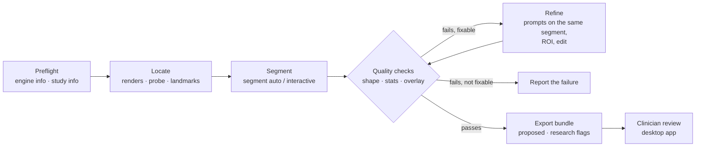

# Agent segmentation scenarios — design

This document designs how an AI agent segments images with FERRUM and the
engines that already connect to it through
[`ferrum-engine/1`](engine-protocol.md): nnInteractive, TotalSegmentator
and MONAI Label. The reference machine is a workstation with an **NVIDIA
RTX 3080 / 3080 Ti (12 GB VRAM, Ampere)**; the measurements in §2 come
from a 12 GB RTX 3080. Status: **implemented** (Stage 17 in
[dev_plan.md](../dev_plan.md));
the decisions are in [ADR 0010](decisions/0010-agent-segmentation.md),
the command reference in [agent-cli.md](agent-cli.md#segmentation-engines).

It builds on:
- the agent skill ([agent-skill.md](agent-skill.md)) and its commands
  ([agent-cli.md](agent-cli.md)), including `engine info`,
  `segment interactive` and `segment auto` (Stage 15.7);
- the bridges and their set-up ([ai-demo.md](ai-demo.md),
  [`bridges/`](../bridges));
- the dataset workflow of Stage 16 (confirm in bulk, export only
  confirmed items).

The principles do not change: engines propose, the agent proposes, a
clinician confirms; numbers come from voxels; no identifiers leave FERRUM.

## 1. What is available today

### Engines and models

| Engine (bridge) | Mode | Models that work through the bridge | Licence (FERRUM badge) |
|---|---|---|---|
| nnInteractive (`ferrum-bridge nninteractive`) | interactive: point ±, planar box, scribble, lasso, undo | `nnInteractive_v1.0`: any structure, CT/MR/PET, 3D from 2D prompts | weights CC BY-NC-SA 4.0 → *research use only* |
| TotalSegmentator (`ferrum-bridge totalsegmentator --task T`) | automatic, one task per bridge process | `total` (117 CT classes), `total_mr` (50 MR classes); open sub-tasks such as `lung_vessels`, `lung_nodules`, `pleural_pericard_effusion`, `liver_vessels`, `liver_segments`, `cerebral_bleed`, `kidney_cysts`, `body`; licensed tasks such as `heartchambers_highres`, `coronary_arteries`, `tissue_types`, `appendicular_bones` | code and `total` Apache-2.0; licensed tasks → *research use only*. The bridge reads the status from TotalSegmentator's registry, so `engine info` is authoritative |
| MONAI Label (`ferrum-bridge monailabel`) | interactive (`deepedit`, `deepgrow`, `annotation`/SAM2) and automatic (`segmentation`) | *radiology* app: DeepEdit (abdominal organs), DeepGrow 2D/3D, SAM2 (clicks, box), `segmentation`, `segmentation_spleen`; *monaibundle* app: single-channel bundles such as `spleen_ct_segmentation`, `swin_unetr_btcv_segmentation`, `wholeBody_ct_segmentation` (low-res), `prostate_mri_anatomy` | per model; *research use only* unless `--clinical-weights` |
| Mock / fake | both, region growing, no model | — | for tests and evaluations |

Not usable through the current protocol, so out of scope here:
- multi-channel models such as BraTS (T1, T1c, T2, FLAIR at once): a
  session carries one volume;
- detection-only bundles (boxes, no mask), e.g. `lung_nodule_ct_detection`;
- MONAI Label infer types other than the three above (VISTA3D needs a
  bridge extension; see §9).

### What the agent could do before Stage 17

| Command | Before | Gap for the scenarios (closed by Stage 17) |
|---|---|---|
| `engine info [--engine URL]` | capabilities, labels, licence | none |
| `segment interactive [--engine URL] [--name N] PROMPT…` | point ± and box prompts in one call; uploads the **whole volume**; every call creates a **new segment** proposed by the engine | no refinement of an existing object; no ROI (VRAM, upload time); no scribble/lasso; the prompts are not stored |
| `segment auto [--engine URL] [--label L]…` | one job, waits up to `engine_job_timeout_s`; one segment per structure found | no name prefix (two engines give two `liver`s); no progress over MCP |
| `segment rename/delete` | agent segments only | the agent cannot clean up engine segments it requested (failed attempts, cross-check sets) |
| `stats --segment`, `view … --overlay segments` | values and outlines | no shape, components or agreement measures; no automatic checks |

Constraints of the data model that shape the scenarios:
- one `u8` label map per workspace: at most 255 segments, and **a voxel
  belongs to one segment only**;
- engine results never overwrite voxels of existing segments; the
  overlap is reported by the `overlap` check (§4).

## 2. GPU budget on a 12 GB RTX 3080 / 3080 Ti

| Workload | VRAM (from the engines' guidance) | Fits next to |
|---|---|---|
| nnInteractive, one session | about 10 GB recommended; grows with the uploaded volume | nothing heavy |
| TotalSegmentator `total`, 1.5 mm | about 10 GB | nothing heavy |
| TotalSegmentator `--fast` (3 mm) or small sub-tasks | a few GB | MONAI Label |
| MONAI Label radiology models (SegResNet/UNet, DeepEdit) | a few GB each, loaded lazily | TotalSegmentator `--fast` |
| FERRUM desktop (wgpu volume + label textures) | volume size × 2 B + labels, e.g. ~0.4 GB for 512×512×600 | everything; `ferrum-cli` renders on the CPU and needs none |

The numbers above are the engines' guidance. Measured (17.6) with
`scripts/benchmark_engines.py` on an **RTX 3080 12 GB** (driver 610.74,
Windows 10 + WSL 2 Ubuntu 22.04), CT of MSD Task09 `spleen_10`
(512 × 512 × 55, 0.98 × 0.98 × 5 mm, declared CT with
`study open --modality CT`). GPU memory is sampled with `nvidia-smi` every
0.2 s, so peaks are approximate; the baseline (~2.3 GB) is the desktop and
the nnInteractive bridge with its weights loaded:

| Step | Time | GPU memory: baseline → peak | Region sent | Result |
|---|---|---|---|---|
| `study open` | 0.2 s | 2.3 → 2.3 GB | — | — |
| `segment auto`, TotalSegmentator `total`, `--label spleen liver` | 45 s | 2.3 → 4.5 GB | whole series | 2 segments |
| `segment auto`, the same, 4 labels (spleen, kidneys, liver) | 52 s | not sampled | whole series | 4 segments, Dice spleen 0.954 vs ground truth |
| `segment interactive`, one point (ROI) | 0.9–1.2 s | 2.3 → 7.7 GB | 0.2–0.4 M voxels | 247–270 ml, Dice 0.937 vs ground truth |
| refinement (replay + 1 prompt) | 0.8–1.1 s | 2.3 → 7.7 GB | the same ROI | stability 0.976–0.980 |
| `segment interactive`, one point (whole volume) | 1.2 s | 2.3 → 7.7 GB | 14.4 M voxels | 30 ml (under-segmented) |
| `segment shape` / `compare` / `stats` / renders (CPU) | 0.2–0.5 s | no GPU | — | — |

What the measurement shows:

- Both engines fit the 12 GB card with room to spare, but only in turn:
  nnInteractive takes ~5.4 GB over the baseline, TotalSegmentator ~2.2 GB
  for two organs; with the desktop app on top, the GPU group rule (1)
  stays.
- The TotalSegmentator child process returns its memory after each job
  (the next step starts from the baseline again), as rule 2 intends.
- nnInteractive's peak hardly depends on the uploaded size (it works on
  patches around the prompts), so the ROI (rule 3) saves upload time
  rather than memory on a series of this size. On this series it also
  gave the right object: the same point on the whole volume gave a 30 ml
  fragment of the spleen; the `roi` check and the scenarios keep the ROI
  the default.
- A value range taken from the spleen's own 5th–95th percentiles leaks
  into the liver and stomach in `segment threshold`; the `max_ml` limit
  stops it (`limit`), and the agent narrows the range or uses
  nnInteractive instead (S5).

**Rules for 12 GB:**

1. **One heavy engine at a time.** nnInteractive and TotalSegmentator
   `total` share the card only in turn. The operator puts engines that
   share a card into one GPU group (§5.1); `ferrum-agent` then runs one
   engine call of the group at a time, and the agent never runs two
   engine commands in parallel.
2. **Release memory when idle.**
   - The TotalSegmentator bridge runs each job in a child process, so
     its memory returns to the driver when the job ends.
   - The nnInteractive bridge keeps one inference session whose image
     stays on the GPU after `DELETE` (it only resets the interactions
     today). It must drop the image and empty PyTorch's cache when the
     last FERRUM session closes. The weights stay loaded.
3. **Crop before upload.** `segment interactive` uploads a region of
   interest, not the whole series (§5.3). The default ROI is the prompts'
   bounding box plus 48 mm, clamped to the volume. A 160 mm cube of a
   0.8 mm CT is ~8 M voxels instead of ~150 M: nnInteractive stays well
   inside 12 GB and the upload is instant. The protocol needs no change:
   the sub-volume is declared with its own `dims` and shifted `origin`,
   and the mask is placed back onto the full grid.
4. **Prefer `--fast` for orientation.** A whole-body overview (which
   organs are where, which vertebral level) uses `total --fast`; the
   full model runs only on the structures the task needs (`--label`,
   which the bridge passes as `roi_subset` for `total` and `total_mr`).
5. **Back off on `busy`.** `engine_unavailable` with the hint
   "retry in N s" means wait, not switch engines silently.

Suggested set-ups (Docker compose profiles in `bridges/`, Stage 17):

| Profile | Runs on the card | Use |
|---|---|---|
| `interactive` | nnInteractive | lesions, unusual structures, corrections (S2, S5, S6) |
| `automatic` | TotalSegmentator `total` (+ more TotalSegmentator bridges for sub-tasks, used in turn) | organ and structure volumetry (S1, S4, S7) |
| `mixed` | TotalSegmentator `--fast` and sub-tasks + MONAI Label | detection with cross-checks, SAM2 (S1, S3) |
| `sequential` | all bridges; one GPU group, so FERRUM serialises them | composite scenarios (S3, S6) |

## 3. Scenario catalogue

| # | Scenario | Engines (3080 Ti profile) | Agent's input | Main output |
|---|---|---|---|---|
| S0 | Engine preflight and choice | all | task, study | the engine to use, or a clear refusal |
| S1 | Organ volumetry | TotalSegmentator `total`/`total_mr`; cross-check MONAI `segmentation` | organ names | volumes in ml, value statistics, agreement |
| S2 | Lesion by prompts | nnInteractive; alternatives MONAI SAM2 / DeepGrow | a location (text, slice, point) | lesion segment, volume, long and short axis |
| S3 | Detect, then refine | TotalSegmentator `lung_nodules` (or another sub-task) → nnInteractive | "find and measure all …" | one proposed segment per candidate |
| S4 | Fluid and tissue quantification | TotalSegmentator `pleural_pericard_effusion`, `body`, licensed `tissue_types` | the quantity | volumes with method and limits |
| S5 | Correct an existing segmentation | nnInteractive (lasso from the mask + points) | a proposed or imported segment | corrected segment, change report |
| S6 | Follow-up comparison | TotalSegmentator `--fast` (landmarks) + nnInteractive | two studies, one lesion | volumes at both time points and the change |
| S7 | MR structures | TotalSegmentator `total_mr`; MONAI `prostate_mri_anatomy`; nnInteractive | a single-channel MR series | segments and volumes, no physical unit |
| S8 | Pre-labelling a dataset | TotalSegmentator `--fast`/`total`, MONAI; review in the desktop app | many studies, one protocol | proposals for Stage 16 review; only confirmed labels exported |

Every scenario runs the same loop:



Command lines use the syntax of [agent-cli.md](agent-cli.md); options
marked **(new)** came with Stage 17 (§5).

### S0 — Engine preflight and choice

1. `study info`: modality, `value_unit`, dims, spacing, warnings. Stop on
   irregular spacing, missing coverage or the wrong modality.
2. `engine info --engine URL` for each allowed engine (`engine list`
   **(new)** lists them at once): modes, prompts, modalities, labels,
   `research_only`, licence.
3. Choose by the table; ask the user when only a research-only engine
   can do the task.

| Task | First choice | Fallback | Refuse when |
|---|---|---|---|
| Named organ or structure in CT | TotalSegmentator `total` (label in `labels`) | MONAI `segmentation`, then nnInteractive | label unknown to every automatic engine and no location given |
| Named organ in MR | TotalSegmentator `total_mr` | nnInteractive | multi-channel input needed |
| A lesion at a known location | nnInteractive | MONAI SAM2 box, DeepGrow | no location and no detection task |
| "All nodules / effusion / bleed" | the TotalSegmentator sub-task | — | no bridge serves the sub-task |
| A structure no model knows | nnInteractive | `segment threshold` | — |

### S1 — Organ volumetry (CT abdomen: liver, spleen, kidneys)

**Engines:** TotalSegmentator `total` (Apache-2.0); optional cross-check
with MONAI Label `segmentation` (profile `mixed`, or one after the other).

1. S0. Check that the labels exist and that the series covers the
   abdomen (a coronal montage; if unsure, `total --fast` first).
2. `segment auto -w ct1 --engine http://127.0.0.1:8766 --label liver --label spleen --label kidney_left --label kidney_right`.
3. Read the checks (§4) of each segment:
   - one dominant component;
   - touching the volume border means the organ is cut off by the field
     of view: report the volume as a lower bound;
   - laterality: the centroid of `kidney_left` lies on the patient's
     left of the body midline (`+x` in LPS);
   - value statistics (median, IQR in HU) for the reader; the agent
     reports them and does not interpret them;
   - a montage with outlines every 10 slices for the vision model to
     spot gross leaks.
4. Optional cross-check: `segment auto` on MONAI `segmentation` with
   `--name-prefix monai/` **(new)**, then `segment compare` **(new)** per
   organ. Dice below 0.90 or a volume difference above 10 % is reported as
   *engines disagree* with both values; the agent does not pick one.
   Because a voxel holds one label, the second run only fills voxels the
   first left free; the cross-check therefore runs in a second workspace
   on the same series (`study open -w ct1-monai`), and `segment compare`
   takes the other workspace's segment.
5. `export bundle`; summary: organ, volume in ml, method (engine, task,
   version), failed checks, items to review.

### S2 — Lesion by prompts (liver lesion, lung nodule, lymph node)

**Engine:** nnInteractive (research use only). MONAI SAM2 (box + clicks)
or DeepGrow (clicks) when that licence is not acceptable; the checks are
the same.

**Input:** a location from the user or another skill, e.g. "segment 4,
axial slice 87" or a point in mm.

1. Locate:
   - `view slice` with a matching window and `view mpr` through the point;
   - the vision model points at the lesion on the render (`r-0007:412,318`);
     `probe` and `profile` across it confirm a value contrast against
     the surroundings;
   - if the lesion cannot be found, stop and say so — never prompt
     blindly.
2. First call: `segment interactive -w ct1 --name "Lesion 1" +r-0007:412,318`.
   For low contrast, a box on the slice with the largest cross-section is
   better: `+box:r-0007:380,290:r-0007:445,350`.
3. Refine on the same segment, `--segment 7` **(new)**, at most
   `max_prompts_per_object` prompts (default 8):
   - render the largest slice and both ends of the segment with outlines
     (`segment shape` **(new)** gives these slices);
   - a leak (outline crosses a boundary visible on the image, values
     outside the lesion's range, sudden growth in ml) → an exclude point
     on the leak: `--segment 7 --append -r-0009:301,255`;
   - a miss → an include point there, preferably on another slice;
   - stop when two successive revisions agree (Dice ≥ 0.95, reported in
     `checks.stability`) or at the limit, and say which.
4. Measure from voxels: `segment shape` (volume, extent, longest axial
   diameter and its perpendicular with the endpoints) and `stats
   --segment 7`. Optionally record the long axis as a distance annotation
   so the reviewer sees what was measured.
5. Export; flag *research use only*; the prompts used are in the
   segment's provenance.

**12 GB card:** measured ~5.4 GB over the baseline for the nnInteractive
session and about a second per prompt, refinements included (§2).

### S3 — Detect, then refine ("find and measure all lung nodules")

**Engines:** TotalSegmentator `lung_nodules` (candidates), then
nnInteractive (boundaries). Profile `sequential`.

1. S0; check a chest CT with thin slices (≤ 2.5 mm, else warn that small
   nodules are missed).
2. `segment auto --engine <lung_nodules bridge> --name-prefix candidate/`.
3. `segment components -w W L --min-ml 0.01 --split` **(new)**: one
   proposed segment per connected component, with centroid, box and
   volume, sorted by volume.
4. For each candidate (at most `max_candidates`, default 20; the rest are
   listed, not refined):
   - `view mpr` through its centroid; the vision model labels it
     *plausible* or *doubtful* (vessel cross-section, scar, artefact) and
     says why — doubtful candidates are kept, with the reason as text;
   - `segment interactive` with a box on the candidate's largest slice
     plus a centre point (both from `segment shape`), into `Nodule N`;
   - `segment compare` candidate vs. refined: a refined volume more than
     3× the candidate's is a leak → one exclude round (S2.3), else
     report it.
5. Table: nodule, location (lung lobe from `total` if it ran, slice
   number, mm), volume, long/short axis, flags.

### S4 — Fluid and tissue quantification

**Engines:** TotalSegmentator `pleural_pericard_effusion`; `body` for the
body outline; licensed `tissue_types` only with a licence number and the
research badge.

As S1, with these rules:
- effusion per side by laterality; a volume below 5 ml is reported as
  "not reliably measurable", not as a number;
- tissue at a level (e.g. L3): find `vertebrae_L3` with `total --fast`,
  take its axial slice range from `segment shape`, then
  `stats --segment L --box A B` **(new)**: the segment restricted to that
  slab, giving the slab volume and values (area per slice is the slab
  volume over its thickness).

### S5 — Correct an existing segmentation

**Input:** a proposed or imported segment that the reviewer or a check
found wrong in one region.

1. Locate the error on renders with outlines (`view slice --overlay segments`).
2. For a segment the agent made or asked an engine for:
   `segment interactive --from-segment L` **(new)** seeds the object with
   **lasso prompts made from the segment's mask** on its largest axial,
   coronal and sagittal slices, applies the agent's include/exclude
   points, and writes the engine's result into the same segment (now an
   engine proposal, status *proposed*). Engine objects made by
   `segment interactive` are refined directly (`--segment L --append`).
3. Before the change, copy the segment into a second workspace on the
   same series (or keep its `segment shape`), then `segment compare`
   before/after: change in ml and Dice; the summary says what changed
   and where.
4. A person's segment is never changed (`forbidden`): the agent
   describes the error with location and measurements instead.

### S6 — Follow-up comparison

FERRUM has no registration. Correspondence is anatomical and is always
confirmed by the reviewer.

1. Open both studies in two workspaces.
2. Segment the lesion in the baseline (S2).
3. Describe its position anatomically: nearest vertebral level and organ
   from `total --fast` in both studies, offset in mm from the organ's
   centroid.
4. In the follow-up, render the same anatomical region; the vision model
   locates the lesion; S2 segments it with the same prompt types.
5. Report both volumes and diameters with their methods, the change, and
   *correspondence proposed by the agent*. A lesion that is not found is
   reported as "not found by the agent", never as "resolved".

### S7 — MR structures

- `total_mr` for organs on a single-channel MR series; T2 prostate zones
  with MONAI `prostate_mri_anatomy`; nnInteractive for anything else.
- Values have no physical unit: report volumes and shape, and intensity
  statistics only as "signal, arbitrary units".
- NIfTI carries no modality: the agent takes it from the user or the
  task, and engine commands take `--modality MR` **(new)**.

### S8 — Pre-labelling a dataset (with Stage 16)

- The harness loops over studies: one workspace per study, the same
  engine, task and version for all (`engine info` before each study; the
  batch stops if they change).
- Automatic engines and deterministic checks only, no vision-based
  refinement, so the proposals are reproducible.
- Annotators review the workspaces in the desktop app (16.1 *Confirm
  all*, corrections recorded per 16.3); the dataset is exported with
  `only_confirmed` (16.2), so it never contains unreviewed model output.
- The agent's summary per study lists the failed checks, so annotators
  start with the doubtful cases.
- On a 3080 Ti: `--fast` for screening, the full model for the
  structures of interest, one job at a time.

## 4. Quality checks

Checks are deterministic, computed by `ferrum-agent` from the mask and
returned in `data.checks` of every command that creates or changes a
segment, plus a warning for each failure. The skill tells the agent to
mention every failed check in its answer.

| Check | Computation | Default | On failure the agent… |
|---|---|---|---|
| `empty` | voxel count > 0 | — | reports "the engine found nothing" |
| `size` | volume within `min_ml`/`max_ml` of the call | none | refines (S2) or reports |
| `components` | 26-connected components; share of the largest | largest ≥ 90 % | uses `segment edit --op keep_largest` only for organs, never for lesions |
| `border` | the mask touches the volume border | — | reports "cut off by the field of view; lower bound" |
| `laterality` | `_left`/`_right` in the name vs. the centroid's side of the body midline | — | reports it, never renames |
| `overlap` | voxels the engine marked that another segment owns | > 1 % of the result | reports both segments |
| `roi` | the mask reaches an inner face of the region sent to the engine | — | repeats with a larger `roi` or `whole_volume` |
| `stability` | Dice between the last two revisions of an interactive object | ≥ 0.95 | reports "not converged" |

`checks.failed` lists the failed checks. `checks.research_only` carries
the engine's flag; it is not a failure, but every envelope warns about it
and the agent labels the result in its answer.

The vision model is an extra signal for leaks and misses. It never
replaces a check, and numbers never come from it.

## 5. Changes to FERRUM

All changes are additive to `ferrum-agent/1`, `ferrum-engine/1` and
`ferrum-workspace` v1.

### 5.1 Operator configuration

```toml
[network]
engines = ["http://127.0.0.1:8765", "http://127.0.0.1:8766", "http://127.0.0.1:8767"]
gpu_groups = { rtx3080ti = ["http://127.0.0.1:8765", "http://127.0.0.1:8766"] }   # (new) one call at a time

[limits]
engine_job_timeout_s = 900            # also the longest wait for a GPU group
max_prompts_per_object = 8            # (new)
roi_margin_mm = 48                    # (new)
allow_research_only = true            # (new) false: research-only engines are `forbidden`
```

- The allow-list stays as it is. `gpu_groups` serialises engine calls
  with an advisory lock file per group in the temporary folder, so
  separate CLI processes and the MCP server respect it too.
- `allow_research_only = false` restricts agents to engines whose licence
  allows the site's use.

### 5.2 Commands

| Command | Change |
|---|---|
| `engine list` (new) | every allowed engine: reachable, name, version, modes, `deterministic`, `research_only`, GPU group |
| `segment interactive` | `segment` + `append`/`undo` refine an object; `roi`, `whole_volume` or the default ROI; `from_segment` (lasso seeds); `scribble`/`lasso` prompts (points on one slice); `min_ml`/`max_ml`; `modality`; `agent`; result with `revision`, `roi` and `checks` |
| `segment auto` | `name_prefix`; `modality`; `agent`; `checks` per segment; MCP progress notifications while the job runs |
| `segment components` (new) | 26-connected components: centroid, box, ml; `split` makes a segment of every further component of at least `min_ml` |
| `segment shape` (new) | ml; extent per axis in mm; slice ranges; largest slice per plane; longest axial diameter and its perpendicular with end points; border; components; laterality |
| `segment compare` (new) | Dice, Jaccard, volumes and difference, HD95 and Hausdorff in mm, centroid distance; the second segment may be in another workspace of the same series (`b_workspace`) |
| `segment edit` (new) | `keep_largest`, `fill_holes`, `restrict_to_box`, `remove_small` on a segment the agent created or requested; ml before and after |
| `stats` | `segment` together with `box`: the part of the segment inside the box |
| `segment rename/delete` | also engine segments the agent requested (`requested_by`), never a person's |

Errors keep the existing codes: a busy engine or a GPU group in use is
`engine_unavailable` with a hint to wait; too many prompts is `limit`; a
prompt outside an explicit `roi` is `out_of_volume`.

### 5.3 State: the prompt history is the session

`ferrum-cli` starts a new process per call; the MCP server lives for the
whole agent session. Both give identical results.

- The **prompts of an interactive object are stored in the workspace**
  (`engine_inputs.json`): engine URL and version, ROI, prompts in voxel
  coordinates, revision, number of lasso seeds.
- `segment interactive --segment L --append …` adds to the stored list,
  `--undo` drops its last prompt, otherwise the list is replaced. The
  command line opens a session, uploads the ROI, replays the list,
  writes the segment and closes the session.
- The MCP server keeps up to four engine sessions as a **cache**, keyed
  by workspace, source hash, engine and version, segment and ROI; when
  the cached prompts are a prefix of the new list it sends only the new
  ones. Sessions of engines in a GPU group are closed after each call,
  so an idle session never holds memory another engine needs.
- Engines report `capabilities.deterministic` (default `true`); the
  conformance suite replays prompts on a second session and requires
  the same mask. The nnInteractive bridge reports `true` only with
  `--deterministic`, the MONAI Label bridge `false`; FERRUM then warns
  that replayed results may differ.

### 5.4 Workspace and provenance

- Provenance gains `requested_by` (written only when set):

  ```json
  { "author": { "kind": "engine", "name": "nnInteractive", "version": "2.6.0 (nnInteractive_v1.0)", "research_only": true },
    "requested_by": { "kind": "agent", "id": "harness-42" }, "status": "proposed", "created": "…" }
  ```

  `author` stays the engine: it made the mask. `requested_by` records the
  agent, which may then rename, refine, edit or delete the segment.
  Changing a segment sets it back to *proposed*.
- `engine_inputs.json` (`ferrum-engine-inputs` v1, see
  [workspace-format.md](workspace-format.md)) holds the prompt histories.
  An entry belongs to the segment with the same label and creation time.
- Checks are part of the command results, not of the workspace.

### 5.5 Layering

The mask analysis (components, shape, distance transform, Hausdorff
distance, hole filling) is pure computation on label maps and lives in
`ferrum-domain` (`analysis.rs`), next to the region growing it extends.
`ferrum-agent` therefore needs no new dependency; the planned dependency
on `ferrum-processing` was not needed ([ADR 0010](decisions/0010-agent-segmentation.md),
amendment).

## 6. Skill guidance (additions to `SKILL.md`)

A new reference page, `skills/ferrum/reference/segmentation.md`, holds
S0–S3 and S5 as step lists; `SKILL.md` gains a short section:

```markdown
## Segmentation with engines
- Preflight: `engine info` (or `engine list`). Organs → automatic engine; a lesion at a
  known location → interactive engine. Tell the user if only a research-only engine fits.
- Never prompt an engine before you have seen the target on a render and checked it with
  `probe` or `profile`.
- Point at renders (`r-0007:x,y`). Refine the same segment (`segment`, `append`); at most
  8 prompts per object, then report "not converged".
- Read `checks` after every result and mention every failed one.
- Measure segments with `segment shape` and `stats`, never from the image.
- Engines that disagree: report both values, do not choose.
- Results are proposals; say "research use only" when the engine is marked so.
```

## 7. Testing and evaluation

- **Contract tests** (no GPU, `crates/ferrum-agent/tests/segmentation.rs`):
  every new parameter and command against FERRUM's mock engine through
  the reference server, on the generated phantom: refinement, undo and
  replay; ROI sizes and the `roi` check; lassos, scribbles and seeds;
  shape, components, split, compare across workspaces, edits; checks of
  automatic results and their overlap; operator limits (prompts,
  research-only engines, protected segments); GPU groups; the MCP session
  cache with the same results as the command line; progress
  notifications.
- **Domain tests:** components, hole filling, shape of a box with known
  axes, Dice and Hausdorff of shifted balls, the exact distance transform.
- **Conformance:** a replay round for engines that report
  `deterministic` (`crates/ferrum-engines/tests/conformance.rs`).
- **Bridge tests:** TotalSegmentator jobs in a spawned child process,
  cancellation that ends the process, a failing child; nnInteractive
  releasing the image; `deterministic` in `info`.
- **Skill evaluations** (`skills/ferrum/evals`): three engine tasks
  (volume by prompts, axial long axis, automatic segmentation) with the
  mock engine (`ferrum-cli eval engine`); the grader also checks that the
  required commands were used.
- **GPU evaluations** (manual, on the reference machine; never in CI; no
  data committed): `scripts/benchmark_engines.py` records time and peak
  GPU memory per scenario step; public de-identified datasets with
  ground truth supplied locally (e.g. the Medical Segmentation Decathlon
  *Lung*, *Liver* and *Spleen* tasks, the TotalSegmentator dataset) are
  compared with `segment compare` against the ground truth imported into
  a second workspace.

## 8. Implementation (Stage 17)

| # | Work | State |
|---|---|---|
| 17.1 | Refinement and state: `segment`/`append`/`undo`, stored prompt history, MCP session cache, `requested_by` and the agent's right to clean up | ✅ |
| 17.2 | ROI uploads and `gpu_groups`; `engine list`; `name_prefix`, `modality`, MCP job progress | ✅ |
| 17.3 | Mask analysis: `segment shape`, `components`, `compare`, `edit`, `stats` on a segment within a box, and `checks` on every engine result | ✅ |
| 17.4 | Bridges: TotalSegmentator jobs in a child process; nnInteractive frees the image when a session closes; `deterministic` in `info` and a replay round in the conformance suite; compose profiles for one 12 GB card | ✅ |
| 17.5 | Skill: `reference/segmentation.md` and a `SKILL.md` section; engine evaluations with the mock engine | ✅ |
| 17.6 | Benchmark on a 12 GB card: VRAM peak and time per engine and scenario, recorded in §2 | ✅ RTX 3080 12 GB (`scripts/benchmark_engines.py`) |
| 17.7 | `from_segment` lasso seeds and scribble/lasso prompts in the agent | ✅ |

## 9. Open questions and later work

- **VISTA3D** (MONAI; automatic and point prompts for 127 classes) would
  give one engine with both modes; it needs a MONAI Label infer type in
  the bridge and a VRAM check on 12 GB.
- **Overlapping structures** (a lesion inside an organ) need several
  label maps or a convention. Until then the lesion is segmented first,
  and the organ volume including the lesion is reported as the sum of
  both segments, stated as such.
- **Seeding nnInteractive with a mask** directly (its API takes an
  initial segmentation) would replace the lasso approximation of S5. It
  needs a protocol addition (a `mask` prompt), with
  `docs/engine-protocol.md` and the conformance suite updated.
- **Multi-channel input** (BraTS-type MR) needs a v1 extension for extra
  channels on the same grid.
