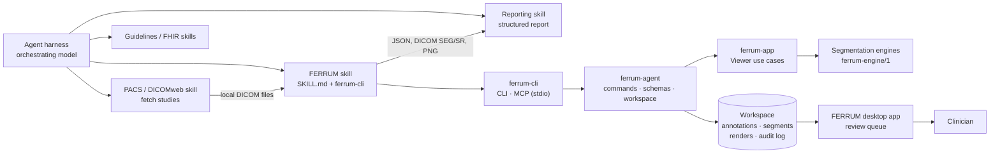

# FERRUM agent skill — design (`ferrum-agent/1`)

This document specifies how AI agents use FERRUM as a *skill*: a package
of instructions plus a tool, `ferrum-cli`, that exposes FERRUM's use
cases to an agent harness. The rationale is in
[ADR 0008](decisions/0008-agent-skill.md). Status: **design**; the
implementation plan is Stage 15 in [dev_plan.md](../dev_plan.md).

## 1. Scope

The skill covers what the desktop viewer does, without a screen:

- open DICOM/NIfTI studies and describe them;
- render slices, MPR and 3D views as images a vision model can read;
- read voxel values and compute statistics;
- measure and annotate;
- create, import, edit and export segments, including AI segmentation
  through the [engine protocol](engine-protocol.md);
- export results in standard formats with provenance;
- hand everything to a clinician for review in the desktop app.

The skill does not:

- retrieve studies from PACS;
- write reports;
- make diagnoses.

Those are other skills in the harness, or people.

## 2. Place in a medical harness



Data passes between skills as files in standard formats. FERRUM never
depends on another skill.

## 3. Principles

| Principle | Consequence |
|---|---|
| Same use cases as the GUI | `ferrum-agent` calls `ferrum-app`; no second implementation of measurements or segmentation |
| Headless and reproducible | No windowing dependency. GPU when available, otherwise the CPU reference renderer (`--renderer cpu` forces it); fixed defaults; every output carries its parameters |
| Private and offline by default | No identifiers in outputs; read-only sources; network only to allow-listed engines |
| Agents propose, people confirm | Everything the agent creates is `proposed` until a human confirms it |
| Values come from voxels | Images are for looking; `probe`, `measure` and `stats` are for numbers |
| Standard formats | NIfTI, JSON with schemas, PNG; DICOM SEG and SR later |
| Versioned contract | `ferrum-agent/1`; additions only, breaking changes need `/2` |

## 4. Packaging

```text
skills/ferrum/
├── SKILL.md                  # when to use, workflows, rules (appendix A)
├── reference/
│   ├── commands.md           # every command with inputs, outputs, examples
│   ├── coordinates.md        # voxel, slice number, patient mm, pixel mapping
│   ├── outputs.md            # JSON formats and links to the schemas
│   └── safety.md             # PHI, clinical safety, provenance
└── schemas/                  # JSON Schemas generated from ferrum-agent types
```

- `SKILL.md` is short. The reference pages are loaded only when the agent
  needs them.
- Release archives contain `ferrum-cli`, the GUI and `skills/ferrum/`.
- For harnesses that install skills and tool servers together, the
  release also contains a plugin manifest that registers the skill and
  the MCP server `ferrum-cli mcp`.

## 5. Transports

Both transports serve the same commands with the same JSON.

**Command line** — for harnesses whose skills run shell commands:

```bash
ferrum-cli study open --workspace ws/ct1 /data/incoming/series-17
ferrum-cli view slice --workspace ws/ct1 --plane axial --slice-number 120 --window lung --out ws/ct1/renders
ferrum-cli measure distance --workspace ws/ct1 --from-mm -42.1,10.5,-130 --to-mm -30.4,12.0,-130
```

- Output is a JSON envelope on stdout; diagnostics go to stderr.
- The exit code is 0 for success, 2 for a usage error and 1 for a
  command error.

**MCP over stdio** — `ferrum-cli mcp --workspace-root ws/` (implemented;
see [agent-cli.md](agent-cli.md#mcp-server)):

- Every command is a tool named like `ferrum_view_slice`, with its JSON
  Schema as the input schema.
- Renders are returned as image content plus the JSON envelope.
- The MCP server keeps loaded volumes and engine sessions in memory. The
  CLI reloads them from the workspace for each call; a CT series loads in
  about 0.3 s.

## 6. Workspace (`ferrum-workspace` v1)

A directory created by `study open` and owned by the agent session:

```text
ws/ct1/
├── workspace.json        # format, version, source paths + SHA-256, series id, defaults
├── annotations.json      # ferrum-annotations v2 (with provenance and status)
├── segments.nii.gz       # label map on the volume grid
├── segments.json         # names, colours, provenance and status per label
├── renders/              # PNG + sidecar JSON with the pixel mapping
└── audit.jsonl           # one line per command: time, command, parameters, outputs, hashes
```

- Source data is referenced, never copied or modified.
- The formats are specified in [workspace-format.md](workspace-format.md)
  (implemented in Stage 15.2).
- If a source file changes (its hash differs), commands fail with
  `source_changed`.
- The desktop app opens a workspace (*File → Open workspace*) and shows
  the review queue (§10).

## 7. Commands (v1)

The command groups mirror the `Viewer` facade. Every command takes
`workspace` and returns the envelope of §8.

| Command | Purpose | Main inputs | Main outputs |
|---|---|---|---|
| `study scan` | List series in files/folders | paths | series: id, modality, dims, description (no PHI) |
| `study open` | Load a series into a workspace | path, series id | dims, spacing, geometry, modality, value unit, slice counts, window presets |
| `study info` | Describe the open study | — | as above plus segments and annotations summary |
| `view slice` | Render one slice | plane, slice number or patient mm, window, size, overlays | PNG + mapping |
| `view mpr` | Three planes through a point | point, window, size | PNG + mapping per panel |
| `view volume` | Render 3D | mode, preset, view (A/P/L/R/S/I or angles), clip box, size | PNG + camera |
| `view montage` | Several slices in one image | plane, slice range and step, window | PNG + mapping per tile |
| `probe` | Value at a point | point | value with unit (HU for CT), voxel, patient mm |
| `stats` | ROI statistics | box, sphere, segment or annotation | count, volume ml, mean, std, min, max, percentiles |
| `profile` | Values along a line | from, to | samples with distance |
| `measure distance/angle/area` | Measurements from points | points | value, unit, uncertainty |
| `annotate add/list/rename/delete` | Named annotations | kind, plane, slice, points, name | annotation with provenance |
| `segment list/add/rename/delete/stats` | Segments | label, name, colour | segments with voxel count and ml |
| `segment threshold` | Region growing from a seed within a value range | seed, range, max volume | segment label, ml |
| `segment import/export` | Label maps | NIfTI path | segments |
| `engine info` | Connected engine capabilities | — | `info` from the engine protocol, `research_only` |
| `segment interactive` | Prompt an interactive engine | segment, prompts (point ±, box, scribble, lasso) | changed box, ml, revision |
| `segment auto` | Automatic engine job | labels | job id, then segments |
| `export bundle` | Everything for hand-off | formats (JSON, NIfTI; later DICOM SEG/SR) | file paths + hashes |
| `review open` | Open the workspace in the desktop app | — | — |

### Points

Commands accept a point in any of three forms, and every output gives
all three:

```json
{ "voxel": [251, 198, 156] }
{ "patient_mm": [-42.1, 10.5, -130.0] }
{ "render": "r-0007", "pixel": [412, 318] }
```

- `voxel` is 0-based `(i, j, k)` in the canonical LPS grid.
- Slice numbers in inputs and texts are 1-based, as in the GUI. JSON
  fields are named `slice_number` (1-based) or `slice_index` (0-based).
- `patient_mm` uses LPS millimetres from the DICOM or NIfTI geometry.
- `render` + `pixel` refer to an earlier render. The server converts
  them with that render's mapping, so the agent can point at what it
  sees.

## 8. Envelope, errors and provenance

```json
{
  "api": "ferrum-agent/1",
  "ok": true,
  "data": { "value": -812.4, "unit": "HU", "voxel": [251, 198, 156], "patient_mm": [-42.1, 10.5, -130.0] },
  "warnings": [],
  "provenance": {
    "ferrum": "0.2.0",
    "command": "probe",
    "params": { "point": { "voxel": [251, 198, 156] } },
    "source_sha256": "9f2c…",
    "renderer": "cpu",
    "time": "2026-10-01T12:00:00Z"
  }
}
```

Errors carry a code, a message and a hint the agent can act on:

```json
{ "api": "ferrum-agent/1", "ok": false,
  "error": { "code": "out_of_volume", "message": "point (512, 3, 7) is outside 512×512×252",
             "hint": "voxel indices are 0-based; the last axial slice is index 251" } }
```

| Code | Meaning |
|---|---|
| `bad_request` | Invalid parameters |
| `no_study` | No study open in the workspace |
| `not_found` | Unknown series, segment, annotation or render |
| `out_of_volume` | Point or box outside the grid |
| `source_changed` | Source data differs from the hashes in the workspace |
| `engine_unavailable` | No engine configured or reachable |
| `forbidden` | Blocked by the operator configuration (network, PHI, paths) |
| `limit` | Size, time or count limit reached |
| `internal` | Anything else |

## 9. Images for vision models

Every render writes a PNG and a sidecar JSON:

```json
{
  "render": "r-0007",
  "kind": "slice", "plane": "axial", "slice_number": 157, "window": { "center": -600, "width": 1500 },
  "size": [768, 768],
  "pixel_to_voxel": [[0.6667, 0, -0.5], [0, 0.6667, -0.5], [0, 0, 156]],
  "pixel_to_patient_mm": [[0.625, 0, -240.47], [0, 0.625, -240.47], [0, 0, -130.0]],
  "pixel_mm": 0.625,
  "orientation": { "left": "R", "right": "L", "top": "A", "bottom": "P" }
}
```

- `pixel_to_voxel` and `pixel_to_patient_mm` are affine maps of
  `(x, y, 1)`, where `x, y` are pixel coordinates and a pixel centre lies
  at `+0.5`.
  - The voxel result is continuous: voxel centres are integers.
  - The example is a 512 × 512 slice (0.9375 mm voxels, origin −240 mm)
    shown at 768 px.
- Optional overlays:
  - orientation letters;
  - a scale bar;
  - a coarse labelled grid (A1, B2…) so the model can name regions;
  - segment outlines;
  - annotation labels.
- Overlays never contain identifiers.
- Images are at most 1024 px per side by default (configurable). Montages
  label every tile with its slice number.
- The skill tells the agent to use images to look and to navigate, and
  to take every number from `probe`, `stats` or `measure`.

## 10. Human in the loop

- Annotations and segments gain provenance:
  - `author`: `human`, `agent` (with the id from the harness, if given)
    or `engine` (name, version, `research_only`);
  - `status`: `proposed`, `confirmed` or `rejected`;
  - `created`;
  - `reviewed_by` and `reviewed` (time), once confirmed or rejected.
- Everything created through `ferrum-cli` is `proposed`.
- The desktop app shows proposed items in a **review queue** with their
  author. The clinician accepts, edits or rejects each item, and the
  decision is written back to the workspace and the audit log.
- A harness may confirm items itself only through
  `review confirm --by <name>` and only if the operator configuration
  allows it. The audit log records the name.
- `export bundle` marks unconfirmed items as such in every output format.

## 11. Privacy and security

The operator configuration (`ferrum-agent.toml`, path from
`FERRUM_AGENT_CONFIG`) is read at start-up. Tool calls cannot change it.

```toml
[data]
read_roots = ["/data/incoming"]       # sources outside are refused
workspace_root = "/data/workspaces"

[privacy]
expose_identifiers = false            # names, IDs, birth dates, accession numbers
expose_dates = false                  # study date/time
pseudonymise_uids = true              # stable salted hashes instead of UIDs

[network]
engines = ["http://127.0.0.1:8765"]   # allow-list; nothing else is contacted

[limits]
max_render_px = 1024
max_voxels = 600_000_000
command_timeout_s = 120

[review]
allow_harness_confirmation = false
```

- No outputs contain identifiers unless the operator allows them; this
  covers JSON, image overlays and file names. Burned-in text inside
  pixel data is a known limit: the skill warns that some series contain
  it.
- Source data is opened read-only. All writes stay in the workspace.
- `ferrum-cli` makes no network calls except to the allow-listed
  engines, which never receive identifiers.

## 12. Clinical safety rules (in `SKILL.md`)

- FERRUM and the skill are not medical devices. Outputs are
  measurements and proposals for review by a qualified person.
- Never state a diagnosis. Describe findings with location (plane, slice
  number, patient mm) and measured values.
- Report every value with its unit and method (for example: distance
  between two points, uncertainty ± one voxel spacing).
- Flag results from engines with `research_only: true` as research use
  only.
- If the data looks wrong, say so instead of continuing. Examples:
  - wrong modality for the task;
  - missing slices or an irregular spacing warning;
  - a series that does not cover the region.
- Always end with the items that need confirmation and how to review
  them (`review open`).

## 13. Testing and evaluation

- **Contract tests:**
  - every command against synthetic phantoms (generated at run time, as
    in the existing tests);
  - JSON validated against the schemas;
  - golden outputs for the CPU renderer.
- **Transport tests:** the same scripted session through the CLI and
  through MCP must give identical JSON.
- **Skill evaluations:** tasks with known answers on phantoms, run with
  a model in the harness. Examples:
  - "What is the diameter of the sphere?";
  - "Segment the bright object and report its volume";
  - "On which axial slice is the lesion largest?".
  Each scores correctness, unit and uncertainty reporting, safety
  wording, and that values came from tools rather than from the image.
- **Security tests:**
  - paths outside `read_roots`;
  - non-allow-listed engine URLs;
  - identifiers in any output (a scan over all produced files).

## 14. Changes to FERRUM

| Area | Change |
|---|---|
| `ferrum-domain` | `Provenance` and `ReviewStatus` on annotations and segments |
| `ferrum-io` | Workspace read/write, `ferrum-annotations` v2, segment metadata JSON; later DICOM SEG and SR (TID 1500) |
| `ferrum-app` | Off-screen render use case returning image + mapping (CPU or headless GPU); stats, profile and threshold region growing |
| `ferrum-agent` (new) | Commands, envelope, errors, JSON Schemas (`schemars`), operator configuration, audit log |
| `ferrum-cli` (new) | Binary: CLI and MCP stdio server; no egui or winit |
| `ferrum` | Open workspace, review queue |
| `skills/ferrum` (new) | `SKILL.md`, reference pages, schemas, plugin manifest |

The layering stays as it is. `ferrum-agent` depends on `ferrum-domain` and
`ferrum-io`: it needs no interactive state from `ferrum-app`, and renders
slices on the CPU. `ferrum-cli` only parses arguments. The implemented
commands are listed in [agent-cli.md](agent-cli.md).

## Appendix A — draft `SKILL.md`

This draft becomes `skills/ferrum/SKILL.md` when `ferrum-cli` ships. Its
commands are not implemented yet.

````markdown
---
name: ferrum-imaging
description: View and measure CT/MR/PET studies (DICOM or NIfTI) with FERRUM — render slices, MPR and 3D, read Hounsfield units, measure distances/areas/volumes, create or import segmentations and export them for review. Use when a task needs to look at or quantify medical images. Not for diagnosis.
---

# FERRUM imaging skill

Tool: `ferrum-cli` (or the `ferrum_*` MCP tools). Every call returns a JSON
envelope; check `ok`, read `warnings`, keep `provenance`.

## Workflow
1. `ferrum-cli study scan <paths>` → pick the series that fits the task
   (modality, slice count, description). Ask if several fit.
2. `ferrum-cli study open --workspace <ws> <path> --series <id>`.
3. Look: `view slice` / `view montage` / `view mpr` / `view volume`.
   Choose the window for the task (lung, soft tissue, bone, brain).
4. Locate structures on the images, then **measure with tools**:
   `probe`, `stats`, `measure`, `segment threshold` or an engine.
   Point at image positions with `{"render": id, "pixel": [x, y]}`.
   Never estimate values or sizes from pixels yourself.
5. Name what you create (`annotate add --name`, `segment add --name`).
6. `export bundle` and tell the user what needs review (`review open`).

## Rules
- Not a medical device. Never give a diagnosis; describe location
  (plane, slice number, patient mm) and measured values.
- Every number with unit and method; distances ± one voxel spacing.
- Everything you create is *proposed* until a clinician confirms it.
- Results from engines marked `research_only` are for research use only.
- If data looks wrong (missing slices, wrong modality, region not
  covered), stop and say so.
- Never try to reveal patient identifiers; they are hidden by design.

## References (read when needed)
- `reference/commands.md` — all commands and examples
- `reference/coordinates.md` — voxel, slice number, patient mm, pixels
- `reference/outputs.md` — output formats and schemas
- `reference/safety.md` — privacy, provenance, review
````
