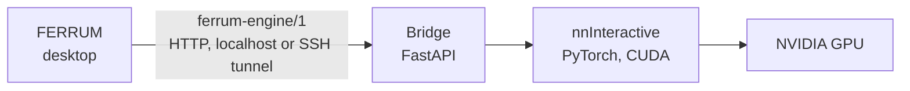

# Demo: interactive AI segmentation with nnInteractive

This guide sets up FERRUM with [nnInteractive](https://github.com/MIC-DKFZ/nnInteractive)
(MIC-DKFZ), a promptable 3D segmentation model:

- you click, drag a box, scribble or draw a lasso on a slice;
- the model segments the object in 3D within a second or two;
- every prompt refines the result.

FERRUM talks to nnInteractive through a small bridge
([`bridges/nninteractive`](../bridges/nninteractive)) that serves the
[FERRUM Engine Protocol](engine-protocol.md). FERRUM itself runs no
inference; the model runs on a GPU machine, which can be your workstation
or a server reached through an SSH tunnel.

> **Research use only.** The nnInteractive code is Apache-2.0, but the
> official model weights are licensed **CC BY-NC-SA 4.0** (non-commercial).
> FERRUM shows a *Research use only* badge for this engine. Neither FERRUM
> nor the bridge bundles the weights: they are downloaded from Hugging Face
> on first start. FERRUM is not a medical device, and AI results are
> proposals for review.



## 1. Requirements

| | |
|---|---|
| GPU machine | Linux with an NVIDIA GPU. About 10 GB of VRAM is recommended; smaller GPUs work for smaller volumes. Use a recent driver (CUDA 12.8 runtime) |
| Software | Docker with the [NVIDIA Container Toolkit](https://docs.nvidia.com/datacenter/cloud-native/container-toolkit/install-guide.html), **or** Python ≥ 3.10 with PyTorch for CUDA |
| Disk | About 10 GB for the image and the model weights |
| FERRUM | Any platform ([releases](https://github.com/Kauter1989/ferrum/releases) or `cargo run --release`) |
| Network | The GPU machine needs internet access once, to download the weights from Hugging Face |

The bridge never receives patient identifiers. FERRUM sends only voxels,
geometry and the modality string.

## 2. Start the bridge

### Option A — Docker (recommended)

```bash
git clone https://github.com/Kauter1989/ferrum
cd ferrum/bridges/nninteractive
docker compose up --build
```

- The first start downloads the default nnInteractive model into the
  `nninteractive-models` volume. This takes a few minutes, and later
  starts are fast.
- The service listens on **`127.0.0.1:8765`** of the host.
- The log shows a line like this:

  ```text
  serving nnInteractive 2.6.0 (nnInteractive_v1.0) on cuda:0 NVIDIA … — Model weights: CC BY-NC-SA 4.0
  ```

### Option B — Python environment

```bash
cd ferrum/bridges/nninteractive
python -m venv .venv && . .venv/bin/activate
pip install torch --index-url https://download.pytorch.org/whl/cu128   # PyTorch for your CUDA
pip install ".[nninteractive]"
ferrum-nninteractive --port 8765           # --device cuda:1, --torch-compile, --model-dir …
```

| Setting | Flag / environment |
|---|---|
| Listen address | `--host` (default `127.0.0.1`) / `FERRUM_BRIDGE_HOST` |
| Port | `--port` (default `8765`) / `FERRUM_BRIDGE_PORT` |
| GPU | `--device cuda:0` / `NNINTERACTIVE_DEVICE` |
| Model | `--model-id` / `NNINTERACTIVE_MODEL_ID`, or an existing folder with `--model-dir` |
| Weights cache | `NNINTERACTIVE_MODEL_DIR` (default `~/.nninteractive`) |
| Access token | `--token` / `FERRUM_ENGINE_TOKEN`; FERRUM must send the same token |
| Faster predictions after a slow first one | `--torch-compile` |

### Check the set-up without a GPU

```bash
pip install . && ferrum-nninteractive --backend fake
```

The fake backend grows regions without a model. With it you can verify the
network path and FERRUM's tools before you spend time on CUDA. FERRUM's own
mock engine works too:
`cargo run -p ferrum-engines --example mock_server -- 127.0.0.1:8765`.

## 3. Reach a remote GPU

The bridge listens on localhost only. To use a GPU server, forward the
port over SSH from the machine that runs FERRUM:

```bash
ssh -N -L 8765:127.0.0.1:8765 user@gpu-server
```

FERRUM then connects to `http://127.0.0.1:8765` as if the engine were local.
If the bridge must listen on a network interface instead, put it behind
TLS and set `FERRUM_ENGINE_TOKEN`.

## 4. Check the protocol (optional)

FERRUM's conformance suite runs against any engine URL:

```bash
FERRUM_ENGINE_URL=http://127.0.0.1:8765 cargo test -p ferrum-engines --test conformance
```

## 5. Walkthrough

The walkthrough uses the demo chest CT `lung_053` from the Medical
Segmentation Decathlon (*Task06_Lung*, CC BY-SA 4.0). Any CT or MR study
works the same way.

1. **Open the study** in FERRUM (drag the folder or `.nii.gz` onto the
   window). Choose the **2D** view and the **Lung** window preset.
2. **Connect.** In the settings panel (**Tab**), open *AI segmentation*.
   - Check the URL (`http://127.0.0.1:8765`, or `FERRUM_ENGINE_URL` when
     you start FERRUM) and press **Connect**.
   - The status shows *nnInteractive … cuda:0*, the licence, and the
     *Research use only* badge.
3. **First prompt.** Select **AI point** with **Include** and click inside
   the lesion on an axial slice.
   - The first prompt uploads the volume (a few seconds for 512×512×250)
     and the model computes its features.
   - The result appears as *AI segment 1*, in 2D and in 3D.
4. **Refine.**
   - Too much? Switch to **Exclude** and click on the leaking part.
   - Too little? Click with **Include** on another slice, or use
     **AI box** to drag a box around the lesion on a slice.
   - **AI scribble** and **AI lasso** paint or outline larger structures.
   - **Undo prompt** reverts the last prompt.
5. **Accept** keeps the segment and starts a new object; **Discard** throws
   the object away.
6. **Name and measure.** In *Segments*, rename the segment (e.g.
   *Tumour*), adjust its colour and opacity, and read its volume in ml.
   Switch to **3D** to see it in context; clipping helps to look inside.
7. **Export** the label map as NIfTI (*Segments → Export*). It keeps the
   patient-space geometry, so other tools (ITK-SNAP, 3D Slicer, Python)
   place it on the original image.

## 6. Troubleshooting

| Symptom | Cause and fix |
|---|---|
| *engine unreachable* | The bridge is not running, listens on another port, or the SSH tunnel is down. Test with `curl http://127.0.0.1:8765/v1/info` |
| *unauthorized* | The bridge was started with a token; start FERRUM with the same `FERRUM_ENGINE_TOKEN` |
| `could not select device driver "nvidia"` | Install the NVIDIA Container Toolkit and restart Docker |
| CUDA out of memory | Use a GPU with more memory, or a smaller or cropped volume. One session runs at a time |
| Very slow prompts | You are running on the CPU (`--device cpu`) or the first prediction is compiling (`--torch-compile`) |
| Weights do not download | The GPU machine needs access to `huggingface.co` once; or download elsewhere and pass `--model-dir` |
| The segment ignores voxels of another segment | By design: AI prompts do not overwrite accepted segments. Delete or edit the other segment first |

## 7. How it works

- **Connection:** FERRUM calls `GET /v1/info` and enables only the tools
  the engine supports.
- **Upload:** the first prompt opens a session (`POST /v1/sessions`) and
  uploads the volume once (`PUT …/volume`, gzip). CT is sent as `int16`
  Hounsfield units, other modalities as `float32`.
- **Prompts:** each prompt (`POST …/prompts`) returns the box that
  changed. FERRUM fetches only that part of the mask (`GET …/mask?box=`)
  and writes it into the target segment.
- **Objects:** Accept and Discard reset the engine's object
  (`POST …/reset`); the volume stays uploaded.
- **Inside the bridge:** the bridge maps the protocol onto nnInteractive's
  `nnInteractiveInferenceSession`. It handles points, 2D/3D boxes, and
  scribble and lasso masks cropped to their box, plus single-level undo.

The same protocol will connect MONAI Label and TotalSegmentator through
their own bridges (Stage 14.6).
