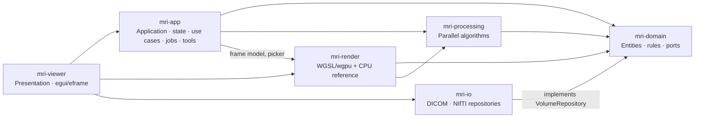
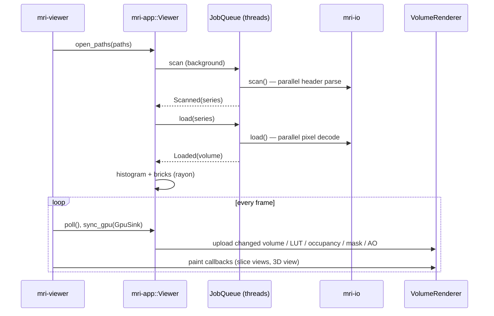

# Architecture

This workspace re-implements the non-segmentation
functionality of the author's earlier web viewer (React/WebGL, whose ray-casting shaders were ported to WGSL): DICOM/NIfTI loading, 2D slices, MPR,
GPU volume rendering, transfer function editing, clipping, measurements
and the volume eraser. See [ADR 0001](decisions/0001-rust-desktop-viewer.md)
for the motivation.

## Layers and crates

| Crate | Responsibility | Must not |
|---|---|---|
| `mri-domain` | `Volume`, `WindowLevel`, `TransferFunction`, `RenderSettings`, `ClipSettings`, `OrbitCamera`, slice geometry, annotations, `VoxelMask`; the `VolumeRepository` port | do I/O, know GPUs or UI |
| `mri-processing` | histogram, min/max bricks, ambient occlusion, filters, resampling (rayon) | own application state |
| `mri-io` | DICOM scan → series grouping → slice ordering → parallel decode; NIfTI read/write with reorientation to LPS | know about rendering or UI |
| `mri-render` | `FrameParams` (pure), WGSL shaders, `VolumeRenderer` (feature `gpu`), `CpuRaycaster` | own application state |
| `mri-app` | `Viewer` facade, background `JobQueue`, `ToolController`, `GpuSink` port | depend on wgpu or egui |
| `mri-viewer` | panels, widgets, paint callbacks, dialogs; composition root | contain business logic |

## Data flow

## Rendering pipeline

1. **Ray setup** — one full-screen triangle; each fragment unprojects its
   NDC through `inverse(projection × view)`.
2. **Analytic clipping** — slab test against the model box, then up to
   eight half-spaces (`ClipSettings::half_spaces`): clip box, oblique plane
   and view-aligned cut. Entering through a cut marks the pixel so the raw
   slice can be blended in ("cut plane opacity").
3. **Marching** — step `1 / (100 + 700·quality)` model units, per-pixel
   jitter against wood-grain artefacts, early termination at α = 0.97.
4. **Empty-space skipping** — an occupancy texture (one texel per 8³ brick)
   is derived from brick min/max and `RenderSettings::range_visible`; empty
   bricks are skipped to their exit, snapped to the sampling grid so the
   image is unchanged.
5. **Modes** (pipeline constant `MODE`):
   `Tissue` (triangular band + shaded surface), `Isosurface` (first hit,
   6-step bisection, Phong + AO), `MIP`, `TransferFunction`
   (LUT-based DVR with opacity correction).
6. **Presentation** — the 3D view is rendered into an off-screen target at
   dynamic resolution (reduced while rotating) and blitted into egui.
   2D slices sample the same 3D texture directly in the egui pass.

The CPU renderer (`mri-render/src/cpu/raycast.rs`) mirrors every step and
is kept in sync by the GPU/CPU parity tests.

## Coordinate systems

| Space | Definition |
|---|---|
| Patient frame | LPS for every loaded volume: `+i` patient left, `+j` posterior, `+k` superior (DICOM native; NIfTI reoriented from `sform`/`qform`) |
| Voxel `(i, j, k)` | column, row, slice; linear index `i + j·nx + k·nx·ny` |
| Texture `t ∈ [0,1]³` | voxel centres at `(i + 0.5)/n` |
| Model `p` | box centred at 0, longest physical side = 1: `p = (t − ½)·extent` |
| Slice view `uv` | `u` right, `v` down; head at the top for coronal/sagittal |
| Annotations | in-plane millimetres from the image's top-left corner |

## Feature mapping from the web viewer

| Earlier web viewer | This workspace |
|---|---|
| `LoaderDicom.js`, `LoaderDcmDaikon.js` | `mri-io::dicom` (dicom-rs, parallel) |
| `LoaderNifti`, `SaverNifti.js` | `mri-io::nifti` |
| `Graphics2d.jsx` + `tools2d/*` | `mri-app::tools`, `mri-viewer::ui::slice_view`, `shaders/slice.wgsl` |
| `VolumeRenderer3d.js` + `gfx/*` + `shaders/*` | `mri-render` (`volume.wgsl`, `VolumeRenderer`) |
| `TransFunc.js`, `transferTexture.js`, `UiHistogram.jsx` | `mri-domain::transfer`, `mri-processing::histogram`, `ui::tf_editor` |
| `ambientTexture.js` | `mri-processing::ambient_occlusion` |
| `Eraser.js` | `mri-domain::mask`, `Viewer::erase_at` |
| `imgproc/Gauss.js`, `Sobel.js` | `mri-processing::filters` |
| TF.js segmentation, ROI palettes | out of scope |
