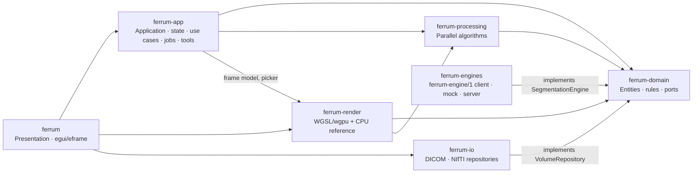

# Architecture

FERRUM is a reusable visualisation core ([vision](vision.md)).

- It provides DICOM/NIfTI loading, 2D slices, MPR, GPU volume rendering,
  transfer function editing, clipping, measurements, annotations,
  segments and the volume eraser.
- It reaches everything else through ports: data sources, segmentation
  engines and (later) exporters.
- The same use cases serve the desktop UI, embedding applications and
  the planned agent skill.

This document describes how the workspace is layered and which
conventions every crate follows. The README lists the rendering
techniques and their references.

## Layers and crates

| Crate | Responsibility | Must not |
|---|---|---|
| `ferrum-domain` | `Volume` with its patient `Geometry`, `WindowLevel`, `TransferFunction`, `RenderSettings`, `ClipSettings`, `OrbitCamera`, slice geometry, annotations, `VoxelMask`, `LabelMap` / `SegmentationSet`; the `VolumeRepository` port | do I/O, know GPUs or UI |
| `ferrum-processing` | histogram, min/max bricks, ambient occlusion, filters, resampling (rayon) | own application state |
| `ferrum-io` | DICOM scan → series grouping → slice ordering → parallel decode; NIfTI read/write with reorientation to LPS; NIfTI label maps mapped onto the volume grid; annotation JSON | know about rendering or UI |
| `ferrum-render` | `FrameParams` (pure), WGSL shaders, `VolumeRenderer` (feature `gpu`), `CpuRaycaster` | own application state |
| `ferrum-engines` | `HttpEngine` (`ferrum-engine/1` client over HTTP), `MockEngine` (region growing, no model), reference protocol server and conformance suite | know about rendering or UI |
| `ferrum-app` | `Viewer` facade, background `JobQueue`, `ToolController`, `GpuSink` port | depend on wgpu or egui |
| `ferrum` | panels, widgets, paint callbacks, dialogs; composition root | contain business logic |

## Extension points

FERRUM is a visualisation core meant to be extended
([ADR 0007](decisions/0007-extensibility-and-engine-protocol.md)):

| Extension | Port (in `ferrum-domain`) | Status |
|---|---|---|
| Data sources | `VolumeRepository` | implemented: DICOM, NIfTI |
| Segmentation engines | `SegmentationEngine`, `InteractiveSession` | implemented: `ferrum-engines` with `HttpEngine`, `MockEngine` and a reference server; the AI panel follows |
| Exporters | `Exporter` | planned; annotation JSON export exists |

Out-of-process engines (nnInteractive, MONAI Label, TotalSegmentator or
any other) speak the [FERRUM Engine Protocol](engine-protocol.md) through
thin bridges in `bridges/`. Implementations are composed at compile time;
native plugins are not loaded dynamically.

FERRUM is also planned as an **agent skill**
([ADR 0008](decisions/0008-agent-skill.md), [specification](agent-skill.md)).
Two new crates will sit beside the desktop app on top of `ferrum-app`:
`ferrum-agent` (typed `ferrum-agent/1` commands, JSON Schemas, workspaces,
audit log) and `ferrum-cli` (a command line and an MCP server, with no UI
dependencies). Agents work in workspaces that the desktop app opens for
clinician review.

## Data flow

## Rendering pipeline

1. **Ray setup** — one full-screen triangle; each fragment unprojects its
   NDC through `inverse(projection × view)`.
2. **Analytic clipping** — slab test against the model box, then up to
   eight half-spaces (`ClipSettings::half_spaces`): clip box, oblique plane
   and view-aligned cut. Entering through a cut marks the pixel so the raw
   slice can be blended in ("cut plane opacity").
3. **Marching** — step `1 / (100 + 700·quality)` model units, per-pixel
   jitter against wood-grain artefacts, early termination at α = 0.97.
4. **Empty-space skipping** — an occupancy texture (one texel per 8³ brick)
   is derived from brick min/max and `RenderSettings::range_visible`; empty
   bricks are skipped to their exit, snapped to the sampling grid so the
   image is unchanged.
5. **Modes** (pipeline constant `MODE`):
   `Tissue` (triangular band + shaded surface), `Isosurface` (first hit,
   6-step bisection, Phong + AO), `MIP`, `TransferFunction`
   (LUT-based DVR with opacity correction).
6. **Segment overlay** — when segments are shown, every sample looks up
   the `u8` label map (nearest voxel, hidden where the eraser removed
   material). Entering a visible label composites the segment colour once,
   front to back, with the segment's opacity and diffuse shading from the
   label boundary normal. Empty-space skipping is disabled while segments
   are shown, because brick occupancy describes intensities only. In 2D the
   slice shader blends the segment colour (fill) and draws a one-pixel
   outline where the label changes between neighbouring screen pixels.
7. **Presentation** — the 3D view is rendered into an off-screen target at
   dynamic resolution (reduced while rotating) and blitted into egui.
   2D slices sample the same 3D texture directly in the egui pass.

The CPU renderer (`ferrum-render/src/cpu/raycast.rs`) mirrors every step and
is kept in sync by the GPU/CPU parity tests.

## Coordinate systems

| Space | Definition |
|---|---|
| Patient frame | LPS for every loaded volume: `+i` patient left, `+j` posterior, `+k` superior (DICOM native; NIfTI reoriented from `sform`/`qform`) |
| Voxel `(i, j, k)` | column, row, slice; linear index `i + j·nx + k·nx·ny` |
| Texture `t ∈ [0,1]³` | voxel centres at `(i + 0.5)/n` |
| Model `p` | box centred at 0, longest physical side = 1: `p = (t − ½)·extent` |
| Slice view `uv` | `u` right, `v` down; head at the top for coronal/sagittal |
| Annotations | in-plane millimetres from the image's top-left corner |
| Patient position | `Volume::voxel_to_patient(v) = origin + direction · (v ⊙ spacing)` (LPS, mm): DICOM Image Position/Orientation of the first ordered plane; NIfTI `sform`/`qform` carried through the reorientation |
| Label maps | one `u8` per voxel on the volume grid (`0` background, `1–255` segments); NIfTI label maps are permuted/flipped onto that grid using both geometries |
