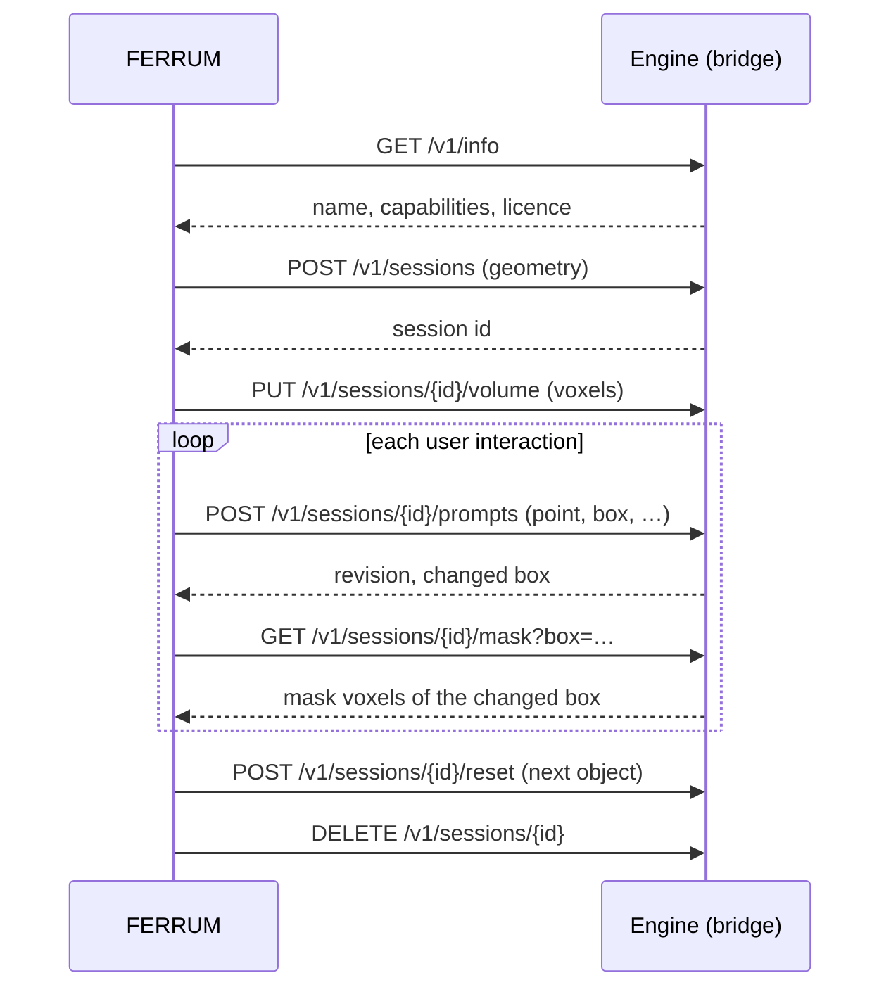

# FERRUM Engine Protocol — `ferrum-engine/1`

The FERRUM Engine Protocol is an HTTP API between FERRUM (the client) and a
segmentation engine (the server). It lets out-of-process engines, written
in any language, offer interactive and automatic segmentation. The design
rationale is in [ADR 0007](decisions/0007-extensibility-and-engine-protocol.md).

The key words MUST, SHOULD and MAY are used as in RFC 2119.

## 1. Overview



- A **session** holds one volume and one **target mask**: the object being
  segmented. Prompts refine the target mask. After a reset, the next
  object starts with an empty mask on the same volume.
- FERRUM decides what to do with a finished mask (for example, store it
  as a segment). The engine does not keep accepted results.

## 2. Conventions

### Transport

- HTTP/1.1 or newer. All endpoints live under `/v1` relative to a base URL
  configured in FERRUM, for example `http://localhost:8765/v1/info`.
- Control messages are JSON (`application/json`, UTF-8). Voxel arrays are
  raw bytes (`application/octet-stream`).
- Binary request bodies MAY be sent with `Content-Encoding: gzip`, and
  servers MUST accept it. Servers SHOULD gzip binary responses when the
  request carries `Accept-Encoding: gzip`.
- Clients MUST ignore unknown JSON fields. Servers MUST ignore unknown
  request fields.

### Security

- Servers SHOULD listen on `127.0.0.1` by default.
- For remote use, deploy behind TLS or an SSH tunnel.
- A server MAY require `Authorization: Bearer <token>`. FERRUM then sends
  the token configured by the user.

### Voxel arrays and coordinates

- A volume has `dims = [nx, ny, nz]`. The voxel `(i, j, k)` is stored at
  linear index `i + nx·(j + ny·k)`: `i` varies fastest.
- All numbers are little-endian. The volume data types are `int16`,
  `uint16` and `float32`; masks are `uint8` with values 0 and 1.
- **Prompts and masks use voxel indices of the uploaded grid.** Engines
  never need to reorient anything.
- FERRUM sends volumes in its canonical frame. Axis `i` points towards
  patient left, `j` posterior and `k` superior (LPS).
  - `spacing` gives voxel size in millimetres.
  - `origin` gives the patient-space position (LPS, mm) of voxel
    `(0, 0, 0)`.
  - `direction` gives the patient-space unit vectors of the `i`, `j`
    and `k` axes, as three rows.
  - Engines that work in physical units (resampling, fixed-mm models)
    use these fields.
- A **box** is a half-open voxel range `min ≤ (i, j, k) < max`. A planar
  box has `max − min = 1` along one axis.

### Privacy

The protocol never carries patient identifiers or DICOM headers. It sends
only voxels, geometry and the modality string.

### Errors

Errors use HTTP status codes and a JSON body:

```json
{ "error": { "code": "unsupported_prompt", "message": "lasso prompts are not supported" } }
```

| Status | `code` | Meaning |
|---|---|---|
| 400 | `bad_request` | malformed request, wrong array size, invalid box |
| 401 | `unauthorized` | missing or wrong token |
| 404 | `not_found` | unknown or expired session, unknown job |
| 409 | `no_volume` | prompt or mask request before the volume was uploaded |
| 413 | `too_large` | volume larger than `limits.max_voxels` |
| 422 | `unsupported_prompt` | the engine does not support this prompt type |
| 503 | `busy` | engine at capacity; the client SHOULD retry after `Retry-After` |
| 500 | `internal` | any other failure |

## 3. Endpoints

### `GET /v1/info`

Describes the engine. FERRUM calls it when connecting and enables only
the tools the engine supports.

```json
{
  "protocol": "ferrum-engine/1",
  "name": "nnInteractive",
  "version": "1.0",
  "vendor": "MIC-DKFZ (bridge: FERRUM)",
  "device": "cuda:0 NVIDIA RTX 4090",
  "capabilities": {
    "interactive": true,
    "automatic": false,
    "prompts": ["point", "box", "scribble", "lasso"],
    "planar_boxes_only": true,
    "undo": false
  },
  "modalities": ["CT", "MR", "PT"],
  "labels": [],
  "research_only": true,
  "license": "Model weights: CC BY-NC-SA 4.0",
  "limits": { "max_voxels": 600000000, "session_ttl_s": 3600 }
}
```

- `protocol` (required) MUST be `ferrum-engine/1`. FERRUM refuses other
  values.
- `capabilities.prompts` lists any of `point`, `box`, `scribble` and
  `lasso`.
- `labels` is used by automatic engines: `[{ "value": 1, "name": "liver",
  "color": [221, 130, 101] }, …]`. `color` is optional.
- `research_only: true` makes FERRUM show a *Research use only* badge next
  to the tools.

### `POST /v1/sessions`

Creates a session and declares the volume that will be uploaded.

Request:

```json
{
  "dims": [512, 512, 252],
  "dtype": "int16",
  "spacing": [0.9375, 0.9375, 1.25],
  "origin": [-240.0, -240.0, -315.0],
  "direction": [[1, 0, 0], [0, 1, 0], [0, 0, 1]],
  "modality": "CT",
  "value_unit": "HU"
}
```

- `origin`, `direction`, `modality` and `value_unit` are optional.
- `value_unit` is `"HU"` for CT, otherwise `""`.

Response `201 Created`:

```json
{ "session_id": "3f1c…", "expires_in_s": 3600 }
```

Sessions expire after `session_ttl_s` of inactivity. Every request on a
session resets the timer.

### `PUT /v1/sessions/{id}/volume`

Uploads the voxels: `nx·ny·nz` values of the declared `dtype`, optionally
gzip-encoded. The response is `204 No Content` once the engine is ready
for prompts. Engines that pre-compute features (image embeddings) do it
here, so the first prompt is fast.

### `POST /v1/sessions/{id}/prompts`

Adds one prompt to the current object. `positive: false` marks
background.

```json
{ "type": "point", "positive": true, "voxel": [251, 198, 156] }
```

```json
{ "type": "box", "positive": true, "min": [200, 150, 156], "max": [300, 260, 157] }
```

```json
{
  "type": "lasso",
  "positive": true,
  "min": [210, 160, 156],
  "max": [290, 250, 157],
  "mask": "<base64 of uint8 0/1 values over the box, i fastest>"
}
```

- `scribble` has the same fields as `lasso`.
- `mask` covers exactly the box `max − min`.

Response `200 OK`:

```json
{ "revision": 3, "changed": { "min": [180, 140, 120], "max": [320, 280, 190] }, "empty": false }
```

- `revision` increases with every change of the target mask.
- `changed` bounds every voxel that differs from the previous revision.
  It is `null` if nothing changed.

### `GET /v1/sessions/{id}/mask?box=i0,j0,k0,i1,j1,k1`

Returns the target mask over the box (the whole volume if `box` is
omitted): `uint8` 0/1 values, `i` fastest. The response carries the
header `X-Ferrum-Revision: <n>`. FERRUM normally requests exactly the
`changed` box of the last prompt.

### `POST /v1/sessions/{id}/undo`

Optional. It is available if `capabilities.undo` is `true`. It removes
the last prompt and returns the same body as a prompt. Engines without
it return `422`, and FERRUM then undoes locally to the previous mask.

### `POST /v1/sessions/{id}/reset`

Clears the prompts and the target mask, ready for the next object, and
keeps the volume. Response `204`.

### `DELETE /v1/sessions/{id}`

Frees the session. Response `204`. Servers MUST also free sessions on
expiry.

## 4. Automatic segmentation (optional)

Engines with `capabilities.automatic: true` (for example TotalSegmentator)
also implement the following endpoints. Interactive-only engines return
`404` for them.

- `POST /v1/sessions/{id}/segment` with `{ "labels": ["liver", "spleen"] }`
  (`null` means all labels) starts a job and returns `202 Accepted` with
  `{ "job_id": "…" }`.
- `GET /v1/jobs/{job_id}` returns
  `{ "state": "queued|running|done|failed|cancelled", "progress": 0.42, "message": "…" }`.
- `DELETE /v1/jobs/{job_id}` cancels the job.
- `GET /v1/sessions/{id}/labelmap` returns the result once the job is
  `done`: `uint16` label values on the volume grid, `i` fastest. The
  values refer to `info.labels`.

## 5. Versioning and conformance

- The version is part of the path (`/v1`) and of `info.protocol`. Fields
  and endpoints may be added to v1; anything that would break an existing
  client needs `/v2`.
- The crate `ferrum-engines` contains:
  - the client, `HttpEngine`;
  - `MockEngine`, a deterministic engine without a model that uses region
    growing;
  - a reference server that serves any engine. Run
    `cargo run -p ferrum-engines --example mock_server -- 127.0.0.1:8765`
    to try the AI tools without a GPU.
- The conformance suite (`crates/ferrum-engines/tests/conformance.rs`)
  checks any server, so third-party engines can test themselves:

  ```bash
  FERRUM_ENGINE_URL=http://127.0.0.1:8765 [FERRUM_ENGINE_TOKEN=…] \
    cargo test -p ferrum-engines --test conformance
  ```

- The mask's `X-Ferrum-Revision` header and the error codes are part of
  the conformance suite.

## 6. Mapping of the planned bridges

| Engine | Bridge | Prompts | Automatic | Notes |
|---|---|---|---|---|
| nnInteractive | [`bridges/nninteractive`](../bridges/nninteractive) (Python, FastAPI; [demo guide](ai-demo.md)) | point, box (planar), scribble, lasso | — | Weights CC BY-NC-SA 4.0 → `research_only: true`; NVIDIA GPU, ~10 GB VRAM recommended |
| MONAI Label | `bridges/monailabel` | point (DeepEdit / DeepGrow / SAM2) | app models | Translates sessions to MONAI Label's datastore and `/infer` |
| TotalSegmentator | `bridges/totalsegmentator` | — | yes, 117 CT / 50 MR classes | Some subtasks need a licence; the bridge reports this in `license` |
