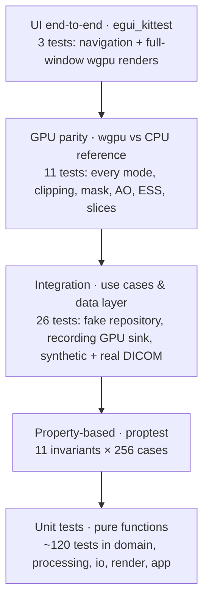

# Test suite

The test suite is designed along the layers of the architecture: the lower
the layer, the more exhaustive and the faster the tests. Everything runs
headlessly with `cargo test --workspace` (≈ 180 tests, < 1 minute after
compilation); GPU tests use any Vulkan/Metal/DX12 adapter, including the
software rasteriser *lavapipe* used in CI.

```bash
make test               # all tests; GPU tests skip if no adapter exists
make test-gpu           # same, but a missing adapter is a failure (CI)
make lint               # rustfmt + clippy -D warnings
make bench              # criterion benchmarks
```

## Test pyramid



| Layer | Location | What is verified |
|---|---|---|
| Domain unit | `ferrum-domain/src/**` `#[cfg(test)]` | volume storage round-trip, trilinear sampling = GPU filtering, window/level & LUT, transfer-function validation/editing/baking, clipping half-spaces, camera maths, slice extraction & view mapping, measurements (distance, angle, shoelace area), eraser mask & undo |
| Domain properties | `ferrum-domain/tests/properties.rs` | TF samples bounded, `max_opacity_in` dominates samples (soundness of empty-space skipping), TF edits keep invariants, window monotonic, storage error bounded, ray/box interval inside box, clipping never extends a segment, camera orbit keeps distance, slice coordinates in unit cube, view mapping round-trip, trilinear sample in range |
| Processing | `ferrum-processing/src/**` | histogram counts/percentiles/peaks, brick ranges bound every trilinear sample, AO on analytic half-space, box filter, Gaussian mass conservation, Sobel edge response, resampling factors |
| Data layer | `ferrum-io/tests/dicom_integration.rs`, `src/**` | synthetic DICOM (explicit/implicit VR LE, big endian, signed + rescale, MONOCHROME1, multi-frame, missing positions, multiple series, corrupt files), progress & cancellation, NIfTI round-trip (plain/gzip), optional **real series** given by `FERRUM_SAMPLE_DICOM=<dir>` |
| DICOM export | `ferrum-io/tests/dicom_export.rs`, `scripts/validate_dicom_export.py` | SEG frames, pixel bits and positions on a synthetic CT, source image references, SR measurements with 3D coordinates and segment volumes, review status, privacy (no source UIDs, dates or identifiers without consent), non-DICOM sources; with `FERRUM_DICOM_EXPORT_DIR=<dir>` the samples are kept and the CI bridge job reads them back with highdicom |
| Shaders | `ferrum-render/tests/shader_validation.rs` | WGSL parses and validates with naga (no GPU needed); `MODE` override exists; uniform block sizes equal the Rust `#[repr(C)]` structs |
| GPU parity | `ferrum-render/tests/gpu_parity.rs` | GPU image vs CPU reference (mean abs. difference < 2.5/255, < 2 % outliers) for tissue, isosurface, MIP, TF-DVR, clip box + view cut + cut surface, oblique plane, eraser mask, ambient occlusion; empty-space skipping leaves the image unchanged in every mode; GPU slice rendering equals domain slice extraction ±2/255; oversized volumes downsample to fit the device |
| CPU renderer | `ferrum-render/src/cpu/raycast.rs` | shading sanity, picking, mask effect, TF lookup |
| Application | `ferrum-app/tests/use_cases.rs`, `src/tools.rs` | load flow (auto-load, series choice, errors), GPU synchronisation uploads only what changed (volume, LUT, occupancy, full vs partial mask, AO), eraser + undo + reset (3D only), tools offered per view mode, the segmentation workflow and the region tool (`tests/workflow.rs`; noise-robust growing, bridge cutting and hole filling in `ferrum-domain/src/region.rs`), background AO, filters replace dataset, slice navigation, windowing, MPR navigation, measurements in mm from screen input, text annotation flow, probe, slice rect fitting, reload resets state; every 2D tool state machine |
| UI | `ferrum/tests/ui.rs` | the real `ViewerApp` driven through the accessibility tree (welcome screen, mode/tool/render-mode switching, the tools and settings each view mode offers, the segmentation path with the region tool and AI engines, Details tab) and full-window wgpu renders of 2D, 3D (4 modes) and MPR asserting the views are drawn |

## Oracles

- **CPU reference renderer** — `CpuRaycaster` mirrors `volume.wgsl`
  function by function (same sampling, jitter hash, compositing, empty-space
  skipping) and is the oracle for GPU output.
- **Domain extraction** — `SliceImage::extract` + `WindowLevel::apply` is the
  oracle for the GPU slice shader.
- **Analytic phantoms** — spheres, half-spaces and ramps with known answers
  (e.g. AO of a half-space, isosurface hit position of a sphere).
- **Synthetic DICOM generator** — `ferrum-io/tests/common/mod.rs` writes
  series at test time with configurable transfer syntax, rescale, sign,
  photometric interpretation, frames and geometry; no image data is
  committed.

## Benchmarks

| Bench | Crate | Measures |
|---|---|---|
| `processing` | `ferrum-processing` | histogram, brick grid, AO, downsampling on 256³; Gaussian/Sobel on 96³ |
| `dicom_loading` | `ferrum-io` | header scan and full load of a 256×256×128 series |
| `render` | `ferrum-render` | CPU reference per mode; GPU per mode with/without empty-space skipping |

Reference numbers (4-core container, llvmpipe software GPU):
histogram 1.5 Gvoxel/s, bricks 2 Gvoxel/s, AO 256³ in 48 ms, DICOM
128-slice load in 50 ms; empty-space skipping speeds up GPU rendering
1.5–5× (isosurface 23.8 → 4.6 ms at 256² on llvmpipe).

## Field tests

Things CI cannot run: real studies, drivers, engines. The scripts are
throw-away (skill `ferrum-field-test`); the results are recorded here, with
the criterion they verify.

| Criterion | Level | What was run | Result |
|---|---|---|---|
| 16.6-j (region tool on whole organs) | field | MSD Task03 liver, cases 0, 53, 82, 105 (0.6–0.7 × 0.6–0.7 × 0.7–5 mm), commit `af36501`; the seed is a typical reference voxel, Dice against the reference (liver and tumour) over tolerances ±15 … ±100 HU with the default settings (smoothing 1.5 mm, opening 5 mm, fill holes) | best Dice 0.951, 0.961, 0.883, 0.958 against 0.779, 0.539, 0.564, 0.462 for the old raw method; the working range is ±20 … ±40 HU (narrower stays small, wider leaks and is refused by the size limit). Below 0.90 on case 82: the reference includes a hypodense tumour at the surface, which no threshold fills. One click takes 1–3 s on the 0.7 × 0.7 × 5 mm cases and 10–25 s on the 0.6 × 0.6 × 0.8 mm cases (60 M voxel box); the click runs as a background job (16.6-m): through `Viewer::start_region_at` on real data the click returns in 0.09 s (liver_53) and 0.45 s (liver_82, the 136 M voxel label-map snapshot), the job takes 1.6 s and 10 s, and the Dice is identical to the direct run (0.961, 0.883) |

## Adding tests

- New domain rule → unit test next to it, plus a property if it has an
  invariant.
- New shader feature → implement it in `cpu/raycast.rs` too and add a
  parity case in `gpu_parity.rs`.
- New use case → exercise it through `Viewer` in `ferrum-app/tests/use_cases.rs`
  with the fake repository and recording sink.
- New widget → kittest test in `ferrum/tests/ui.rs`.
