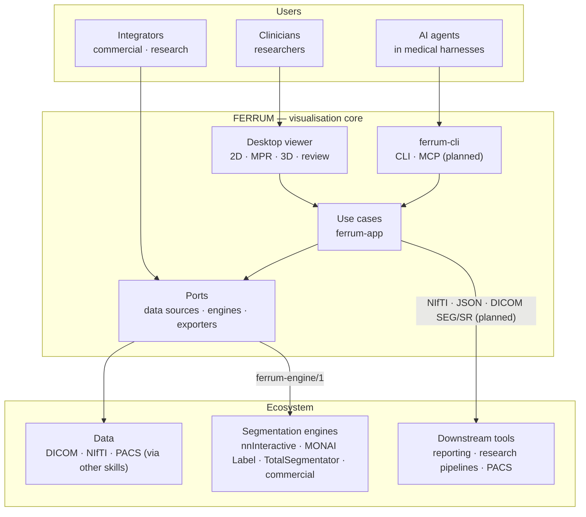

# Vision and principles

FERRUM is a **reusable visualisation core for medical imaging**. It is fast,
GPU-accelerated and written in Rust. People use it as a desktop viewer,
other software embeds it as a component, and AI agents use it as a skill.
FERRUM does not try to be an all-in-one solution. It does one thing very
well, which is showing and quantifying volumetric images. Everything
around that is reached through open interfaces, so FERRUM can work with
many other projects as part of an ecosystem for medical imaging and
patient data, in commercial and research settings alike.

The decisions behind this are recorded in
[ADR 0007](decisions/0007-extensibility-and-engine-protocol.md)
(extensibility and the engine protocol) and
[ADR 0008](decisions/0008-agent-skill.md) (FERRUM as an agent skill).

## Principles

### 1. A core with extension points, not a monolith

- FERRUM owns visualisation and measurement: loading, slices, MPR, 3D
  rendering, annotations, segments and their display.
- Everything else plugs in through **ports** defined in the domain:
  - data sources (`VolumeRepository`);
  - segmentation engines (`SegmentationEngine`);
  - exporters (planned).
- Implementations are composed at compile time. Rust has no stable ABI,
  so native plugins are not loaded dynamically.
- Every use case lives in one application layer (`ferrum-app`) that has
  no GPU or UI dependency. The desktop app, an embedding application and
  the agent tool all drive the same code.

### 2. Open protocols instead of hard-wired integrations

- AI engines run **out of process** and speak the
  [FERRUM Engine Protocol](engine-protocol.md) (`ferrum-engine/1`), a
  small, versioned HTTP API. An engine can be written in any language.
- Each third-party engine gets a thin **bridge** that translates the
  protocol to its own API. The first is nnInteractive, followed by
  MONAI Label and TotalSegmentator.
- Engines can be swapped without code changes. A commercial deployment
  plugs in a commercially licensed engine through the same protocol.
- A conformance suite lets any engine check itself:
  `FERRUM_ENGINE_URL=… cargo test -p ferrum-engines --test conformance`.
- **No inference inside Rust** for now. FERRUM stays small, portable and
  free of model licences.

### 3. AI assists and stays optional

- AI tools live in a separate, collapsible panel. They are **always
  visible but disabled** while no engine is connected, with a hint on how
  to connect one.
- Interactive AI segmentation starts as a **demo** with nnInteractive,
  with a documented deployment (bridge, Docker, GPU requirements,
  walkthrough).
- An engine's licence is shown to the user. For example, nnInteractive's
  weights are CC BY-NC-SA 4.0, so those results carry a *Research use
  only* badge.
- FERRUM's code is MIT and bundles no engine or weights.

### 4. Built for people and for agents

- FERRUM is designed to be used by AI agents as a **skill**
  ([specification](agent-skill.md)). The plan has three parts:
  - a skill package (`SKILL.md` plus references);
  - a headless `ferrum-cli` with a command line and an MCP server;
  - typed, versioned commands (`ferrum-agent/1`) with JSON Schemas.
- **Agents propose, people confirm.** Everything an agent or engine
  creates carries provenance and the status `proposed` until a clinician
  confirms it in the desktop app's review queue.
- **Values come from voxels.** Agents look at rendered images to find
  structures, but every number (Hounsfield units, distances, volumes)
  comes from tools that read the data, with units and uncertainty.

### 5. Trust by design

- **Privacy.** No patient identifiers cross the engine protocol or
  appear in agent outputs by default. Processing is local and offline,
  except for engines on an operator's allow-list. Patient data is never
  committed to this repository.
- **Patient-space correctness.** Every volume knows its position in
  patient space (LPS), and label maps from other tools are placed using
  both geometries.
- **Reproducibility and traceability.** The CPU reference renderer
  reproduces every GPU image, and parity is checked in CI. Results will
  carry provenance (source hashes, parameters, versions) and an audit
  log.
- **Standard formats.** DICOM and NIfTI in; NIfTI label maps and
  JSON with a published format out; DICOM SEG and Structured Reports are
  planned for hand-off to PACS and reporting.
- **Engineering quality** is part of the product:
  - clean architecture;
  - more than 230 tests, including GPU/CPU parity and UI tests;
  - line coverage of about 90 % with a CI floor;
  - an enforced complexity budget;
  - no `unsafe`.

### 6. Fast, everywhere

- A single-pass GPU ray caster with empty-space skipping, dynamic
  resolution and ambient occlusion, based on peer-reviewed techniques.
- Runs on Vulkan, Metal, DirectX 12 and OpenGL through wgpu, on Linux,
  macOS and Windows.
- Parallel DICOM decoding: a 252-slice CT loads in about 0.3 s.

## Not a medical device

FERRUM is research and engineering software. It is not certified as a
medical device and must not be used as the sole basis for diagnosis or
treatment. Measurements, segmentations and AI results are proposals for
review by qualified people.

## Where we are

| Area | Status |
|---|---|
| Viewer: DICOM/NIfTI, 2D, MPR, 3D, transfer functions, clipping, eraser | ✅ v0.1.0 |
| Named annotations with JSON export (study identification, 1-based slices) | ✅ |
| Patient geometry, segments, 2D/3D overlay, NIfTI label maps | ✅ |
| Engine port, `ferrum-engine/1` client, mock engine, reference server, conformance suite | ✅ |
| AI segmentation panel | ✅ |
| nnInteractive bridge and [demo guide](ai-demo.md) | ✅ |
| Automatic segmentation; TotalSegmentator bridge | ✅ |
| MONAI Label bridge | ✅ |
| Provenance on annotations and segments; workspace and result formats ([spec](workspace-format.md)) | ✅ |
| Agent skill command line (`ferrum-cli`, [reference](agent-cli.md)) | ✅ |
| Agent skill over MCP (`ferrum-cli mcp`) | ✅ |
| Agent skill: skill package, review queue, engine commands | 📋 Stage 15 |
| DICOM SEG and SR export | 📋 Stage 15 |

The detailed plan with user stories is in [dev_plan.md](../dev_plan.md).
